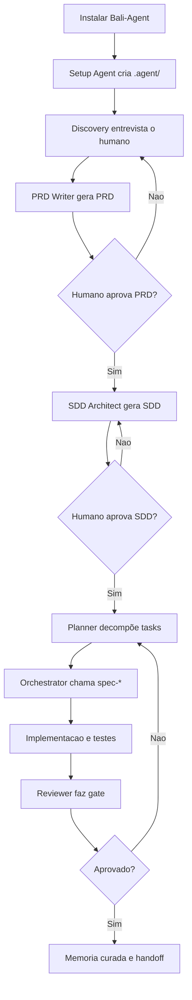
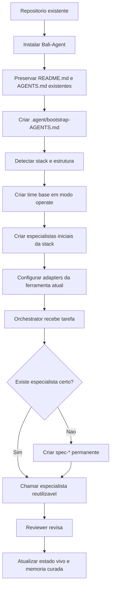

# Bali-Agent AI

[](https://github.com/ba-lison/Bali-Agent/blob/main/LICENSE)

Bali-Agent e um framework agnostico de LLM para engenharia de software com subagentes reais. Ele instala uma camada `.agent/` no projeto, cria um time base reutilizavel, conecta esse time aos adapters das ferramentas conhecidas e usa o Bali Runtime como fallback universal quando a IDE, CLI ou LLM nao oferece subagentes nativos.

## Objetivo Master

O objetivo master do Bali-Agent e simples: **subagentes reais sempre**.

O framework nao foi feito para um unico chat interpretar papeis. Ele foi feito para criar, chamar, persistir e reutilizar subagentes especializados do projeto. O modelo pode mudar. A IDE pode mudar. O CLI pode mudar. O contrato nao muda.

- Claude Code, Codex, OpenCode, Antigravity, Cursor, Gemini, Ollama ou qualquer LLM podem operar o mesmo projeto.
- Se a ferramenta tiver subagentes nativos, o setup cria os arquivos no formato dessa ferramenta.
- Se a ferramenta nao tiver subagentes nativos, o Bali Runtime executa subagentes isolados por prompt, arquivo de saida e processo/comando.
- Se faltar um especialista, o Orchestrator cria um novo `spec-*`, salva em `.agent/team/`, atualiza o manifesto e espelha esse agente nos adapters suportados.
- Se nao existe adapter nem runtime funcional, o framework deve falhar fechado em vez de fingir que um role-play e um subagente.

## O Que Ele Instala

Em um projeto alvo, o setup materializa esta base:

```text
.agent/
  AGENTS.md
  adapters/
  agents/
    _setup/
    _specialists/
    _spine/
  hooks/
  memory.md
  protocols/
    memory.md
    routing.md
    subagents.md
  runtime/
    bali_runtime.py
  subagent.config.yaml
  team/
    orchestrator.md
    discovery.md
    prd-writer.md
    sdd-architect.md
    planner.md
    reviewer.md
    spec-implementer.md
  templates/
  working-context.md
```

Tambem cria ou ajusta arquivos de integracao no projeto:

| Ambiente | O que o Bali-Agent cria |
| --- | --- |
| Claude Code | `CLAUDE.md`, `.claude/agents/*.md`, `.claude/settings.json` com hooks de contexto |
| Codex | `.codex/config.toml`, `.codex/agents/*.toml` |
| OpenCode | `opencode.json`, `.opencode/agents/*.md` |
| Antigravity | `.antigravity/skills/bali-agent/SKILL.md` e contrato de subagents/background subagents quando disponivel |
| Cursor | `.cursor/rules/bali-agent.mdc` |
| Gemini CLI | `.gemini/settings.json` |
| Ollama ou API crua | `.agent/runtime/bali_runtime.py` com `BALI_LLM_COMMAND` |

O arquivo `AGENTS.md` da raiz passa a ser a constituicao operacional do projeto. Em projeto existente, o setup preserva arquivos do usuario e grava o bootstrap em `.agent/bootstrap-AGENTS.md`.

## Time Base

A espinha fixa fica em `_spine/`:

- `orchestrator`: recebe todo pedido, escolhe o fluxo, chama subagentes e nunca trabalha sozinho.
- `planner`: quebra trabalho em tarefas atomicas quando a tarefa precisa de decomposicao.
- `reviewer`: revisa entrega, risco, testes e aderencia ao objetivo antes da resposta final.

O time base de produto fica em `.agent/team/`:

- `discovery`: entrevista, leitura de contexto e clarificacao de problema.
- `prd-writer`: transforma discovery em PRD.
- `sdd-architect`: transforma PRD em SDD e arquitetura.
- `spec-implementer`: especialista generico inicial para implementacao.

Especialistas permanentes do projeto usam o prefixo `spec-*`, por exemplo `spec-payments`, `spec-auth`, `spec-rendering`, `spec-mobile`. Eles nao morrem no fim da sessao: ficam salvos em `.agent/team/`, entram em `.agent/subagent.config.yaml` e sao espelhados nos adapters nativos quando possivel.

Nao existe um "recrutador" separado por padrao. Essa responsabilidade fica no Orchestrator porque criar outro subagente fixo so para recrutar aumentaria complexidade sem ganho real. Quando o Orchestrator detecta uma lacuna de especialidade, ele cria o novo especialista reutilizavel.

## Fluxo Do Ciclo De Vida

O Bali-Agent tem dois fluxos oficiais: projeto novo e projeto existente.

### Projeto Novo

Em greenfield, o objetivo e sair de uma ideia pouco definida para uma base implementavel com documentos, plano e time criado.



Passos esperados:

1. Rodar o setup no diretorio do novo projeto.
2. Discovery coleta contexto, objetivos, restricoes e criterios de sucesso.
3. PRD Writer gera o PRD.
4. Humano aprova ou corrige o PRD.
5. SDD Architect gera o SDD.
6. Humano aprova ou corrige o SDD.
7. Planner quebra em tarefas pequenas.
8. Orchestrator chama especialistas existentes ou cria novos `spec-*`.
9. Reviewer bloqueia entrega fraca antes de commit, PR ou resposta final.
10. Bali Runtime registra apenas memoria curada relevante.

### Projeto Existente

Em brownfield, o objetivo e entrar em um repositorio real sem destruir as regras existentes e montar um time que entende aquele sistema.



Passos esperados:

1. O setup preserva arquivos ja existentes do projeto.
2. A camada `.agent/` recebe os protocolos, templates, runtime e adapters.
3. O manifesto `.agent/subagent.config.yaml` inicia em `mode: operate`.
4. O time base e criado mesmo quando o projeto ja tem codigo.
5. Especialistas iniciais sao criados a partir da stack detectada.
6. Durante tarefas reais, o Orchestrator cria novos `spec-*` se a stack, dominio ou risco exigir.
7. O Reviewer fecha o ciclo antes de resposta final, commit ou PR.
8. `.agent/working-context.md` guarda estado vivo; `.agent/memory.md` guarda historico curado.

## Memoria

Bali-Agent separa memoria operacional de historico reutilizavel.

- `.agent/working-context.md`: estado vivo do trabalho atual, handoff, riscos imediatos e proximas acoes. Nao e historico permanente.
- `.agent/memory.md`: historico curado de decisoes, commits, PRs, incidentes, aprendizados e verificacoes importantes.

Registro curado pelo runtime:

```bash
python .agent/runtime/bali_runtime.py remember \
  --kind commit \
  --title "corrige fluxo de autenticacao" \
  --ref "abc1234" \
  --summary "ajusta expiracao de sessao e cobre regressao" \
  --files "src/auth/session.ts, tests/auth/session.test.ts" \
  --tests "pytest"
```

O comando `remember` rejeita texto com cara de segredo. A regra e registrar o que ajuda o proximo trabalho, nao despejar log bruto.

## Como Usar

Clonar o framework:

```bash
git clone https://github.com/ba-lison/Bali-Agent.git
cd Bali-Agent
```

Instalar em um projeto alvo:

```bash
python init.py /caminho/do/projeto
```

Validar a instalacao no projeto alvo:

```bash
python .agent/templates/verify_setup.py
python .agent/runtime/bali_runtime.py verify
python .agent/runtime/bali_runtime.py list-agents
python .agent/runtime/bali_runtime.py run --dry-run "implementar login"
```

Criar especialista permanente manualmente quando necessario:

```bash
python .agent/runtime/bali_runtime.py create-agent \
  --id spec-payments \
  --scope "Especialista reutilizavel em pagamentos, checkout e webhooks."
```

Conectar qualquer LLM/CLI sem adapter nativo:

```bash
set BALI_LLM_COMMAND=ollama run llama3.1 ^< {prompt_file}
python .agent/runtime/bali_runtime.py run "revisar fluxo de cadastro"
```

Em PowerShell, configure o comando conforme o CLI usado:

```powershell
$env:BALI_LLM_COMMAND = "ollama run llama3.1 < {prompt_file}"
python .agent/runtime/bali_runtime.py run "revisar fluxo de cadastro"
```

---

### 🚀 Bali Runtime CLI (Subagentes Reais)

Para rodar o time de agentes com **subagentes reais e isolamento de processos** em qualquer ambiente (inclusive Ollama local ou APIs comerciais), execute:

```bash
python .agent/run.py "sua instrução aqui"
```

O runtime utiliza as seguintes variáveis de ambiente para configuração:
- `BALI_LLM_PROVIDER`: `openai` | `anthropic` | `gemini` | `ollama` (padrão: `ollama`).
- `BALI_LLM_MODEL`: nome do modelo a usar (ex: `gpt-4o`, `claude-3-5-sonnet-20241022`, `llama3`).
- `BALI_API_KEY`: chave da API do provedor (ou use as padrão `OPENAI_API_KEY`, `ANTHROPIC_API_KEY`, `GEMINI_API_KEY`).
- `BALI_LLM_ENDPOINT`: URL base se diferente do padrão (ex: URL do Ollama local ou proxy).

---

## Roteamento

O roteamento oficial fica em `protocols/routing.md`.

Regra curta:

- Pergunta simples: Orchestrator pode responder com sanity-check do Reviewer.
- Bug pequeno: Orchestrator chama o especialista certo e Reviewer.
- Feature media/grande: Planner quebra tarefas, especialistas executam, Reviewer fecha.
- Projeto novo: Discovery -> PRD -> SDD -> Planner -> especialistas -> Reviewer.
- Falta de especialista: Orchestrator cria `spec-*` permanente antes de executar.

O protocolo de subagentes reais fica em `protocols/subagents.md`. O protocolo de memoria fica em `protocols/memory.md`.

## Boas Praticas Obrigatorias

- Nunca substituir subagente real por role-play como entrega final.
- Nunca sobrescrever `README.md` ou `AGENTS.md` de um projeto existente sem decisao explicita.
- Nunca registrar segredo em memoria.
- Nunca tratar `.agent/working-context.md` como historico completo.
- Nunca entregar sem Reviewer quando houver mudanca de codigo, arquitetura, PRD, SDD ou memoria.
- Sempre manter os especialistas reutilizaveis dentro de `.agent/team/`.

## Desenvolvimento Do Framework

Verificar integridade dos scripts do framework:

```bash
python -m py_compile init.py templates\verify_setup.py templates\claude_hook.py templates\runtime\bali_runtime.py templates\run.py
git diff --check
```

Arquivos principais:

- `init.py`: instala o framework no projeto alvo.
- `AGENTS.md`: constituicao base do framework.
- `agents/_spine/orchestrator/AGENT.md`: orquestracao e criacao de especialistas.
- `agents/_spine/planner/AGENT.md`: decomposicao de tarefas.
- `agents/_spine/reviewer/AGENT.md`: gate de qualidade.
- `protocols/routing.md`: fluxo proporcional por tipo de trabalho.
- `protocols/subagents.md`: contrato de subagentes reais.
- `protocols/memory.md`: contrato de memoria curada.
- `templates/runtime/bali_runtime.py`: runtime universal (para pipelines).
- `templates/run.py`: runtime agêntico universal (com tool calling e loop dinâmico).
- `templates/subagent.config.yaml`: manifesto do time.

## Estado Atual

O framework esta desenhado para:

- operar em projeto novo ou existente;
- preservar regras locais do projeto;
- criar um time base reutilizavel;
- criar especialistas permanentes quando necessario;
- funcionar de forma agnostica a LLM, IDE e CLI;
- registrar memoria de forma curada;
- manter humano no loop para aprovar PRD, SDD e entregas relevantes.

## License

Distribuído sob a licença [MIT](LICENSE). Copyright (c) 2025 Alison Cruz.
