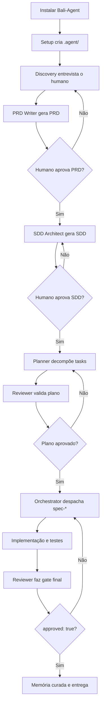
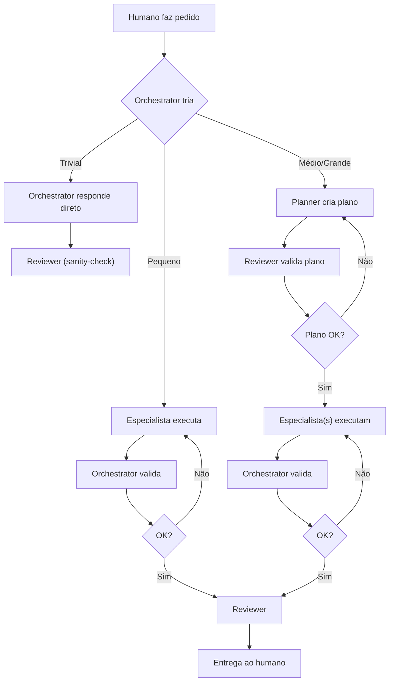

# Bali-Agent

[](https://github.com/ba-lison/Bali-Agent/blob/main/LICENSE)
[](https://github.com/ba-lison/Bali-Agent/actions/workflows/ci.yml)
[](https://www.python.org/downloads/)
[](https://github.com/ba-lison/Bali-Agent/blob/main/CHANGELOG.md)

Framework LLM-agnóstico para engenharia de software com **subagentes reais em topologia hub-and-spoke**. O Orchestrator é o maestro — tria pedidos, responde trivial direto, e para tarefas complexas monta plano, valida o plano, despacha especialistas, itera se necessário, e só entrega após o gate do Reviewer.

---

## Arquitetura: Hub-and-Spoke

```
Humano ↔ Orchestrator (hub — único ponto de contato)
              ↕
    ┌─────────┼─────────┐
    ↓         ↓         ↓
  Planner  Espec.1   Espec.2   ← subagentes reais (isolados)
              ↕
         Orchestrator           ← valida, rejeita, reenvia (até 3x)
              ↓
          Reviewer               ← gate final obrigatório
              ↕
         Orchestrator           ← devolve (ou reenvia se reprovado)
              ↕
           Humano
```

### Como funciona na prática

| Classe do pedido | Quem resolve | Fluxo |
|------------------|-------------|-------|
| **Trivial** ("explica esse arquivo", "que horas são?") | O próprio Orchestrator | Responde direto → Reviewer (sanity-check) |
| **Pequeno** (bugfix, tweak de config) | Especialista | Especialista → Reviewer |
| **Médio/Grande** (feature, refactor, migração) | Time completo | Planner (cria plano) → Reviewer (valida plano) → Especialista(s) → Reviewer |

O Orchestrator tem o poder de **criar subagentes** (`spec-*`) permanentes ou temporários conforme a demanda. Subagentes autorizados (`can_spawn_agents: true`) podem criar seus próprios subagentes (até 2 níveis de profundidade).

### Plataformas suportadas

- Claude Code, Codex, OpenCode, Antigravity, Cursor, Ollama — todo projeto opera o mesmo time `.agent/`.
- Se a ferramenta tem subagentes nativos → o setup cria os arquivos no formato nativo (`.opencode/agents/`, `.claude/agents/`, `.codex/agents/`).
- Se não tem → Bali Runtime executa subagentes isolados por processo (`subprocess.run`, prompt/ output em arquivos separados).
- Se nenhum caminho funciona → falha fechada (sem fingir que role-play é subagente).

---

## Instalação

### Pré-requisitos

- Python 3.11+
- `pyyaml`

### Instalar o pacote

```bash
git clone https://github.com/ba-lison/Bali-Agent.git
cd Bali-Agent
pip install -e .
```

Isso instala o comando `bali` no PATH.

### Instalar no projeto alvo

```bash
bali init /caminho/do/projeto
```

Ou usando o script legado:

```bash
python init.py /caminho/do/projeto
```

---

## CLI — Comandos Disponíveis

```
bali <comando> [opções]
```

| Comando | Descrição |
|---|---|
| `bali init <dir>` | Instala o framework no projeto alvo |
| `bali verify` | Valida a instalação e os adapters ativos |
| `bali verify-adapter <nome>` | Verifica um adapter específico (claude, antigravity, etc.) |
| `bali list-agents` | Lista agentes registrados no manifesto |
| `bali create-agent` | Cria um especialista permanente |
| `bali run <prompt>` | Executa o Orchestrator com o prompt fornecido |
| `bali run --dry-run <prompt>` | Simula execução sem chamar LLM |
| `bali remember` | Registra entrada curada na memória SQLite |
| `bali inspect-runs` | Inspeciona artefatos de execuções anteriores |

### Exemplos

```bash
# Verificar adapters instalados
bali verify

# Criar especialista permanente
bali create-agent --id spec-payments --scope "Pagamentos, checkout e webhooks"

# Rodar orquestração
bali run "implementar autenticação JWT"

# Registrar memória curada
bali remember --kind commit --title "corrige fluxo de auth" --ref "abc1234"

# Inspecionar último run
bali inspect-runs
```

### Variáveis de Ambiente

| Variável | Descrição | Padrão |
|---|---|---|
| `BALI_LLM_PROVIDER` | Provider do LLM (`openai`, `anthropic`, `gemini`, `ollama`) | `ollama` |
| `BALI_LLM_MODEL` | Modelo a usar (`gpt-4o`, `claude-3-5-sonnet-20241022`, `llama3`) | — |
| `BALI_API_KEY` | Chave da API (ou use `OPENAI_API_KEY`, `ANTHROPIC_API_KEY`, etc.) | — |
| `BALI_LLM_ENDPOINT` | URL base alternativa (Ollama local, proxy) | — |
| `BALI_LLM_COMMAND` | Comando shell para LLM via template (`{prompt_file}`, `{output_file}`) | — |
| `BALI_SUBAGENT_DEPTH` | Profundidade atual de subagentes (interno, máx. 2) | `0` |

---

## Estrutura do Pacote

```
bali_agent/
├── cli.py                  # Entrypoint da CLI (bali)
├── core/
│   ├── agent.py            # Classe Agent — carrega frontmatter YAML
│   ├── context.py          # ContextPacker — sliding window, redação de segredos
│   ├── event_log.py        # EventLogger — trace.jsonl, tool_calls.json, approvals.json
│   ├── handoff.py          # HandoffBus — comunicação entre subagentes
│   ├── llm_client.py       # Cliente HTTP para APIs de LLM (OpenAI-compatible)
│   ├── memory.py           # Memória SQLite com FTS5
│   ├── policy.py           # ToolPolicy — classificação de risco e aprovações
│   ├── runner.py           # Runner — loop de orquestração de agentes
│   ├── session.py          # SessionManager — persistência de histórico
│   └── tool_registry.py    # Schemas de tools + get_allowed_schemas (default-deny)
├── security/
│   ├── command_policy.py   # Allowlist de subcomandos por executável
│   ├── path_policy.py      # Validação de paths com realpath normalisation
│   ├── sandbox.py          # _safe_path com commonpath (anti-traversal)
│   └── secret_scanner.py   # Detector de segredos em conteúdo de arquivos
├── tools/
│   ├── approval.py         # request_human_approval_tool
│   ├── filesystem.py       # read_file_tool, write_file_tool
│   ├── git.py              # git_tool (operações read-only)
│   └── shell.py            # run_command_tool (shell=False, timeout=60)
├── adapters/
│   ├── antigravity.py      # Adapter Antigravity (IDE + CLI agy)
│   ├── claude.py           # Adapter Claude Code
│   ├── codex.py            # Adapter Codex
│   ├── cursor.py           # Adapter Cursor
│   ├── ollama.py           # Adapter Ollama
│   └── opencode.py         # Adapter OpenCode
└── templates/
    └── runtime/
        └── bali_runtime.py # Runtime template para modo CLI (BALI_LLM_COMMAND)
```

### O que o setup instala no projeto alvo

```
.agent/
├── AGENTS.md               # Constituição operacional do projeto
├── team/
│   ├── orchestrator.md     # Recebe pedido, escolhe fluxo, chama subagentes
│   ├── planner.md          # Decompõe trabalho em tarefas atômicas
│   ├── reviewer.md         # Gate de qualidade (veredicto JSON obrigatório)
│   ├── discovery.md        # Entrevista e clarificação de problema
│   ├── prd-writer.md       # Gera PRD
│   ├── sdd-architect.md    # Gera SDD e arquitetura
│   └── spec-implementer.md # Especialista genérico de implementação
├── runtime/
│   └── bali_runtime.py     # Runtime universal (fallback sem subagentes nativos)
├── memory/                 # Banco SQLite (memória FTS5)
├── runs/                   # Artefatos por execução
│   └── <run-id>/
│       ├── trace.jsonl
│       ├── tool_calls.json
│       ├── approvals.json
│       ├── handoffs.json
│       ├── context_manifest.json
│       ├── final_diff.patch
│       └── reviewer_report.md
├── protocols/
│   ├── routing.md
│   ├── subagents.md
│   └── memory.md
├── subagent.config.yaml    # Manifesto do time
└── working-context.md      # Estado vivo da sessão atual
```

---

## Adapters Suportados

| Adapter | Subagentes Nativos | Hooks | Verificado |
|---|---|---|---|
| Claude Code | ✅ | ✅ SessionStart / UserPromptSubmit | ✅ |
| Antigravity 2.0 / CLI | ✅ | ❌ | ✅ |
| Codex | ✅ | ❌ | ✅ |
| OpenCode | ✅ | ❌ | ✅ |
| Cursor | ❌ (rules) | ❌ | ✅ |
| Ollama / API crua | ❌ (runtime) | ❌ | ✅ |

---

## Segurança

O Bali-Agent tem um modelo de segurança em camadas aplicado ao runtime:

### Sandbox de filesystem
- `_safe_path()` usa `os.path.commonpath()` para bloquear ataques de prefixo de diretório irmão.
- `is_path_allowed()` usa `os.path.realpath()` para normalizar paths antes de comparar padrões.
- Padrões globalmente bloqueados: `.env`, `.git`, `secrets`.

### Política de comandos (shell=False)
Todos os comandos passam por `classify_command()` com allowlist **por subcomando**, não apenas por executável:

| Executável | Subcomandos permitidos | Bloqueados |
|---|---|---|
| `python` | — | `-c`, `-m` (use pytest/mypy direto) |
| `pytest` | (invocação direta) | — |
| `mypy` | (invocação direta) | — |
| `npm` | `test`, `run` | `exec`, `install`, `i`, `ci`, `publish` |
| `pip` | nenhum | tudo (risco de supply-chain) |
| `cargo` | `test`, `check`, `build` | `run`, `install` |
| `go` | `test`, `build`, `vet`, `fmt` | `run`, `install`, `get` |
| `git` | `status`, `diff`, `log`, `show` | `push`, `commit`, `reset`, `checkout` |

Operadores de encadeamento (`;`, `&&`, `\|`, `$(`) são sempre bloqueados.

### Tool registry — default-deny
- `allowed_tools: []` → agente recebe **zero tools**.
- `allowed_tools: ["*"]` → agente recebe todas as tools (opt-in explícito).
- `allowed_tools: ["read_file", "search_memory"]` → apenas essas duas.

### Reviewer gate — fail-closed
O agente `reviewer` **deve** retornar um JSON válido com `approved: true/false`. Qualquer desvio (sem JSON, JSON malformado, campo ausente) levanta `ValueError` — a execução nunca passa silenciosamente.

```json
{
  "approved": true,
  "summary": "Implementação correta, testes cobrem os fluxos principais.",
  "blockers": []
}
```

### Controle de subagentes
- `can_spawn_agents: false` no manifesto do agente → bloqueio hard no Runner.
- Profundidade máxima de subagentes aninhados: 2 (`BALI_SUBAGENT_DEPTH`).

---

## Time Base

### Hub central

- **Orchestrator**: ponto de contato único com o humano. Tria pedidos, responde trivial direto, e para tarefas complexas coordena Planner → Reviewer do plano → Especialistas → Reviewer final. **Nunca implementa código.** Cria `spec-*` permanentes ou temporários conforme necessário. Valida saída de subagentes e reenvia com feedback se insuficiente (até 3 tentativas).

### Espinha fixa (`_spine/`)

- **Planner**: quebra trabalho complexo em tarefas atômicas, ordenadas e verificáveis. Acionado para pedidos médios/grandes.
- **Reviewer**: gate de qualidade obrigatório em **toda** entrega. Retorna JSON com `approved: true/false` + blockers/warnings/nits.

### Time de produto (`.agent/team/`)

- **discovery**: entrevista e clarificação de problema (modo greenfield).
- **prd-writer**: transforma discovery em PRD.
- **sdd-architect**: transforma PRD em SDD e arquitetura.
- **spec-implementer**: especialista genérico de implementação.

### Especialistas permanentes

Usam o prefixo `spec-*` (ex: `spec-payments`, `spec-auth`, `spec-frontend`). Não morrem no fim da sessão — ficam em `.agent/team/`, entram no `subagent.config.yaml` e são espelhados nos adapters nativos.

---

## Fluxo do Ciclo de Vida

### Projeto Novo (Greenfield)



### Projeto Existente (Operate)



---

## Memória

O Bali-Agent separa memória operacional de histórico reutilizável:

- **`.agent/working-context.md`**: estado vivo da sessão atual, handoff, riscos imediatos. Não é histórico permanente.
- **SQLite FTS5** (`bali_agent/core/memory.py`): histórico curado com busca semântica por palavra-chave.

```bash
# Registrar via CLI
bali remember --kind commit --title "corrige fluxo de auth" --ref "abc1234" \
  --summary "ajusta expiração de sessão" --files "src/auth/session.ts"

# Buscar na memória
bali run "buscar decisões sobre autenticação"
```

O `remember` rejeita automaticamente conteúdo com padrão de segredo (tokens, chaves, passwords).

---

## Testes

```bash
# Rodar todos os testes
python -m pytest tests/ -v --tb=short

# Rodar apenas os testes de segurança
python -m pytest tests/test_runner_security.py -v

# Type check
python -m mypy bali_agent/ --ignore-missing-imports
```

### Cobertura atual

| Suite | Foco |
|---|---|
| `test_policy.py` | ToolPolicy, classificação de risco, redação |
| `test_context_packer.py` | Sliding window, manifest, redação de segredos |
| `test_observability.py` | EventLogger, trace, tool_calls, approvals |
| `test_cli.py` | Inicialização via CLI |
| `test_memory.py` | SQLite FTS5, bloqueio de segredos |
| `test_handoff.py` | HandoffBus send/receive |
| `test_agent_manager.py` | Carregamento e validação de agentes |
| `test_integration.py` | Dry-run e loop de execução |
| `test_security.py` | _safe_path, _sanitize_llm_command, execute_safe_command |
| `test_runner_security.py` | Sandbox commonpath, subcommand policy, default-deny, can_spawn_agents, Reviewer fail-closed |

---

## CI

GitHub Actions roda automaticamente em cada push/PR para `main`:

- `pytest tests/` em Python 3.11 e 3.12
- `mypy bali_agent/ --ignore-missing-imports`

---

## Boas Práticas Obrigatórias

- Esforço proporcional: trivial o Orchestrator responde direto; complexo passa por Planner → Reviewer do plano → especialistas.
- Nunca substituir subagente real por role-play como entrega final.
- Nunca sobrescrever `README.md` ou `AGENTS.md` de projeto existente sem decisão explícita.
- Nunca registrar segredo em memória.
- Nunca tratar `.agent/working-context.md` como histórico completo.
- Nunca entregar sem Reviewer quando houver mudança de código, arquitetura, PRD, SDD ou memória.
- Sempre manter os especialistas reutilizáveis dentro de `.agent/team/`.
- Subagentes com `can_spawn_agents: true` podem criar seus próprios subagentes (máx. profundidade 2).

---

## Arquivos Principais do Framework

| Arquivo | Função |
|---|---|
| `init.py` | Instala o framework no projeto alvo |
| `bali_agent/cli.py` | Entrypoint do comando `bali` |
| `bali_agent/core/runner.py` | Loop principal de orquestração de agentes |
| `bali_agent/core/tool_registry.py` | Registro de tools + default-deny |
| `bali_agent/security/sandbox.py` | Anti-traversal com commonpath |
| `bali_agent/security/command_policy.py` | Allowlist de subcomandos |
| `bali_agent/security/path_policy.py` | Validação de paths com realpath |
| `AGENTS.md` | Constituição base do framework |
| `docs/` | Documentação técnica expandida, threat model |
| `CHANGELOG.md` | Histórico de versões |

---

## License

Distribuído sob a licença [MIT](LICENSE). Copyright (c) 2025–2026 Alison Cruz.
