# 🤖 DevSquad AI

**Orquestração de Engenharia de Software Moderna baseada em Agentes Autônomos**

> **LLM-Agnostic** — Funciona com Claude, GPT, Gemini, Llama, e qualquer LLM.  
> Nenhum vendor lock-in. Nenhuma dependência de modelo específico.

---

## 📋 Visão Geral

O **DevSquad AI** é um sistema de agentes autônomos e LLM-agnostic que orquestram o ciclo completo de engenharia de software — da concepção à entrega. Cada agente possui um papel especializado e segue protocolos rigorosos de qualidade, handoff e aprovação humana.

O sistema transforma uma ideia vaga em software funcional, revisado e pronto para produção, seguindo as melhores práticas de engenharia do Google, métricas DORA, e guidelines de segurança de IA.

### Por que usar?

- **Consistência**: Todo projeto segue o mesmo rigor de engenharia, independente da complexidade
- **Qualidade**: Gates de aprovação humana garantem que nenhum artefato avança sem validação
- **Rastreabilidade**: Cada decisão é documentada, cada handoff é explícito
- **Flexibilidade**: Qualquer LLM pode assumir qualquer papel — use o modelo que preferir
- **Segurança**: Código gerado por IA sempre passa por checklist de segurança antes de merge

---

## 🔄 Fluxo do Ciclo de Vida

```mermaid
flowchart TD
    START["🚀 Novo Projeto"]
    DISCOVERY["🔍 Entrevista Discovery"]
    GATE1{"✅ Gate 1\nValidação do Entendimento"}
    PRD["📄 Geração do PRD"]
    GATE2{"✅ Gate 2\nAprovação do PRD"}
    SDD["🏗️ Arquitetura SDD"]
    GATE3{"✅ Gate 3\nAprovação do SDD"}
    TASKS["📋 Decomposição em Tasks"]
    GATE4{"✅ Gate 4\nValidação de Prioridades\n(opcional)"}
    IMPL["💻 Implementação"]
    REVIEW["🔎 PR Review"]
    GATE5{"✅ Gate 5\nAprovação do PR"}
    DONE["✅ Entrega"]

    START --> DISCOVERY
    DISCOVERY --> GATE1
    GATE1 -- Aprovado --> PRD
    GATE1 -- Feedback --> DISCOVERY
    PRD --> GATE2
    GATE2 -- Aprovado --> SDD
    GATE2 -- Feedback --> PRD
    SDD --> GATE3
    GATE3 -- Aprovado --> TASKS
    GATE3 -- Feedback --> SDD
    TASKS --> GATE4
    GATE4 -- Aprovado --> IMPL
    GATE4 -- Feedback --> TASKS
    IMPL --> REVIEW
    REVIEW --> GATE5
    GATE5 -- Aprovado --> DONE
    GATE5 -- Feedback --> IMPL

    style START fill:#6366f1,color:#fff,stroke:#4f46e5
    style DONE fill:#22c55e,color:#fff,stroke:#16a34a
    style GATE1 fill:#f59e0b,color:#000,stroke:#d97706
    style GATE2 fill:#f59e0b,color:#000,stroke:#d97706
    style GATE3 fill:#f59e0b,color:#000,stroke:#d97706
    style GATE4 fill:#f59e0b,color:#000,stroke:#d97706
    style GATE5 fill:#f59e0b,color:#000,stroke:#d97706
    style DISCOVERY fill:#8b5cf6,color:#fff,stroke:#7c3aed
    style PRD fill:#3b82f6,color:#fff,stroke:#2563eb
    style SDD fill:#3b82f6,color:#fff,stroke:#2563eb
    style TASKS fill:#3b82f6,color:#fff,stroke:#2563eb
    style IMPL fill:#10b981,color:#fff,stroke:#059669
    style REVIEW fill:#ef4444,color:#fff,stroke:#dc2626
```



---

## 🧑‍💼 Time de Agentes

| # | Agente | Papel | Responsabilidade | Arquivo |
|---|--------|-------|------------------|---------|
| 1 | **🎯 Orchestrator** | Maestro do Fluxo | Gerencia o ciclo de vida, roteia entre agentes, aplica gates de aprovação | `agents/orchestrator/AGENT.md` |
| 2 | **🔍 Discovery** | Entrevistador | Conduz entrevista adaptativa para extrair requisitos, contexto e restrições do projeto | `agents/discovery/AGENT.md` |
| 3 | **📄 PRD Writer** | Analista de Produto | Transforma descobertas em PRD completo com escopo, métricas, personas e requisitos | `agents/prd-writer/AGENT.md` |
| 4 | **🏗️ SDD Architect** | Arquiteto de Software | Projeta arquitetura técnica, diagramas, trade-offs e estratégia de implementação | `agents/sdd-architect/AGENT.md` |
| 5 | **📋 Task Decomposer** | Planejador de Tarefas | Decompõe SDD em tasks atômicas (<4h), ordenadas por dependência e prioridade | `agents/task-decomposer/AGENT.md` |
| 6 | **💻 Implementer** | Engenheiro de Software | Implementa código de produção seguindo SDD e tasks, com testes e documentação | `agents/implementer/AGENT.md` |
| 7 | **🔎 Reviewer** | Revisor de Código | Revisa PRs com checklist de qualidade, segurança, performance e manutenibilidade | `agents/reviewer/AGENT.md` |

---

## 📁 Estrutura de Diretórios

```
sdlc-agent-team/
├── README.md                          # Este arquivo — visão geral do sistema
├── AGENTS.md                          # Arquivo raiz que qualquer LLM lê ao iniciar
│
├── agents/                            # Definições de cada agente
│   ├── orchestrator/
│   │   └── AGENT.md                   # Identidade, regras e fluxo do Orchestrator
│   ├── discovery/
│   │   └── AGENT.md                   # Identidade e roteiro do Discovery Agent
│   ├── prd-writer/
│   │   └── AGENT.md                   # Identidade e template do PRD Writer
│   ├── sdd-architect/
│   │   └── AGENT.md                   # Identidade e template do SDD Architect
│   ├── task-decomposer/
│   │   └── AGENT.md                   # Identidade e critérios do Task Decomposer
│   ├── implementer/
│   │   └── AGENT.md                   # Identidade e padrões do Implementer
│   └── reviewer/
│       └── AGENT.md                   # Identidade e checklists do Reviewer
│
├── protocols/                         # Protocolos de operação
│   ├── handoff.md                     # Protocolo de handoff entre agentes
│   ├── approval-gates.md             # Gates de aprovação humana
│   └── quality-gates.md              # Critérios de qualidade por artefato
│
├── templates/                         # Templates de artefatos
│   ├── prd.md                         # Template do PRD
│   ├── sdd.md                         # Template do SDD
│   └── tasks.md                       # Template de tasks
│
├── examples/                          # Exemplos práticos
│   ├── prd-example.md                 # Exemplo completo de PRD
│   └── sdd-example.md                 # Exemplo completo de SDD
│
├── init.py                            # Script Python para inicializar o DevSquad AI em novos projetos
└── output/                            # Artefatos gerados por projeto
    └── .gitkeep
```

---

## 🚀 Como Usar

### Instalação (Inicializar em Novo Projeto)

Você pode copiar a estrutura do **DevSquad AI** para qualquer outro projeto em sua máquina usando o script instalador integrado:

1. Clone este repositório
2. Execute o instalador no seu terminal:
   ```bash
   python init.py
   ```
3. Insira o caminho absoluto para o projeto onde você quer instalar o time de agentes e confirme.

---

### Início Rápido

1. **Abra o projeto**: Abra o projeto inicializado na sua IDE preferida (Cursor, VS Code, etc.).
2. **Carregue o sistema**: Abra ou anexe o arquivo `AGENTS.md` (na raiz do seu projeto) ao chat do seu assistente de IA preferido.
3. **Inicie a execução**: Envie o comando:

   ```
   Novo projeto: [descrição breve do que você quer construir]
   ```

4. **Siga o fluxo**: O Orchestrator assume e guia você por cada fase:
   - 🔍 Entrevista Discovery para entender as necessidades reais (pula perguntas redundantes)
   - 📄 PRD para documentar os requisitos do produto
   - 🏗️ SDD para arquitetar a solução técnica e mapear trade-offs
   - 📋 Tasks para fatiar em tarefas atômicas (<4h)
   - 💻 Código para a implementação guiada
   - 🔎 Review para checagem de qualidade e segurança

5. **Aprove nos gates**: Sempre que o sistema pedir aprovação, revise o artefato gerado na pasta `output/{projeto}/` e dê seu feedback.

### Comandos Disponíveis

| Comando | Descrição |
|---------|-----------|
| `Novo projeto: [descrição]` | Inicia ciclo completo desde a entrevista |
| `Status do projeto` | Mostra em qual fase o projeto está |
| `Revisar [artefato]` | Solicita review de um artefato específico |
| `Aprovar [artefato]` | Aprova o artefato atual e avança para próxima fase |
| `Feedback: [detalhes]` | Fornece feedback para revisão do artefato atual |

---

## 🏛️ Princípios Fundamentais

### Baseado em Práticas de Engenharia de Classe Mundial

| Referência | Princípio Aplicado |
|------------|-------------------|
| **Google Engineering Practices** | Code review rigoroso, PRs pequenos (<400 linhas), documentação como cidadão de primeira classe |
| **DORA 2025 (State of DevOps)** | Foco em lead time, frequência de deploy, taxa de falha, tempo de recuperação |
| **Anthropic Best Practices** | Prompts estruturados, decomposição de tarefas complexas, validação humana em decisões críticas |
| **OpenAI Codex Guidelines** | Geração de código com testes, contexto explícito, iteração incremental |

### Regras Invioláveis

1. ❌ **NUNCA** pular a entrevista para um novo projeto
2. ❌ **NUNCA** gerar SDD sem PRD aprovado pelo humano
3. ❌ **NUNCA** mergear código sem review completo
4. ✅ **SEMPRE** parar e pedir aprovação humana nos gates definidos
5. ✅ **SEMPRE** passar código gerado por IA pelo checklist de segurança
6. ✅ **SEMPRE** documentar decisões e trade-offs

---

## 🔒 Segurança

Todo código gerado pelo sistema passa por verificação de:

- **Secrets**: Nenhuma chave, token ou credencial hardcoded
- **Injeção**: Proteção contra SQL injection, XSS, command injection
- **Dependências**: Verificação de vulnerabilidades conhecidas
- **Autenticação**: Validação de padrões de auth/authz
- **Dados sensíveis**: PII e dados regulados tratados corretamente

---

## 📊 Métricas de Qualidade

O sistema rastreia internamente:

| Métrica | Alvo | Descrição |
|---------|------|-----------|
| Taxa de Aprovação Gate | >80% | Artefatos aprovados no primeiro gate |
| Cobertura de Testes | >80% | Código com testes adequados |
| Tamanho de PR | <400 linhas | PRs revisáveis e atômicos |
| Tasks Atômicas | <4h cada | Tarefas completáveis em uma sessão |
| Ciclo Completo | Variável | Tempo do Discovery ao PR merged |

---

## 🤝 Contribuindo

Este é um sistema aberto e extensível. Para adicionar um novo agente:

1. Crie `agents/[nome-do-agente]/AGENT.md` seguindo o padrão existente
2. Registre o agente na tabela do `AGENTS.md`
3. Defina o handoff de entrada e saída em `protocols/handoff.md`
4. Adicione quality gates relevantes em `protocols/quality-gates.md`

---

## 📜 Licença

Este sistema de orquestração é fornecido como framework de engenharia de software. Use, adapte e melhore conforme necessário para seu contexto.

---

<p align="center">
  <strong>DevSquad AI</strong> — Engenharia de Software Moderna, Orquestrada por Agentes.
  <br/>
  <sub>🤖 LLM-Agnostic · 🔒 Security-First · 📋 Process-Driven · 🧑‍💻 Human-in-the-Loop</sub>
</p>
