# 🤖 Bali-Agent AI

[](https://github.com/ba-lison/Bali-Agent/actions/workflows/tests.yml)

**Orquestração de Engenharia de Software Moderna baseada em Agentes Autônomos**

> **LLM-Agnostic** — Funciona com Claude, GPT, Gemini, Llama, e qualquer LLM.  
> Nenhum vendor lock-in. Nenhuma dependência de modelo específico.

---

## 📋 Visão Geral

O **Bali-Agent AI** é um sistema de agentes autônomos e LLM-agnostic que orquestram o ciclo completo de engenharia de software — da concepção à entrega. Cada agente possui um papel especializado e segue protocolos rigorosos de qualidade, handoff e aprovação humana.

O sistema transforma uma ideia vaga em software funcional, revisado e pronto para produção, seguindo as melhores práticas de engenharia do Google, métricas DORA, e guidelines de segurança de IA.

### Por que usar?

- **Consistência**: Todo projeto segue o mesmo rigor de engenharia, independente da complexidade.
- **Qualidade**: Gates de aprovação humana garantem que nenhum artefato avança sem validação.
- **Rastreabilidade**: Cada decisão é documentada, cada handoff é explícito.
- **Flexibilidade**: Qualquer LLM pode assumir qualquer papel — use o modelo que preferir.
- **Segurança (Agent Shield)**: Proteção ativa local via Git Pre-commit Hook que impede vazamento de arquivos `.env` e chaves de API.
- **Economia de Contexto (Token-Saving)**: Memória dinâmica local (`working-context.md`) que evita a releitura de arquivos e previne a amnésia das IAs.
- **Robustez de Terminal (Antiloop)**: Mecanismo defensivo que interrompe e reverte loops infinitos de tentativas de correção no console após 3 falhas.

---

## 🔄 Fluxo do Ciclo de Vida

```mermaid
flowchart TD
    START["🚀 Novo Projeto"]
    DISCOVERY["🔍 Entrevista Discovery"]
    GATE1{"✅ Gate 1\nValidação do Entendimento"}
    PRD["📄 Geração do PRD"]
    GATE2{"✅ Gate 2\nAprovação do PRD"}
    SDD["🏗️ Arquitetura SDD"]
    GATE3{"✅ Gate 3\nAprovação do SDD"}
    TASKS["📋 Decomposição em Tasks"]
    GATE4{"✅ Gate 4\nValidação de Prioridades\n(opcional)"}
    IMPL["💻 Implementação"]
    REVIEW["🔎 PR Review"]
    GATE5{"✅ Gate 5\nAprovação do PR"}
    DONE["✅ Entrega"]

    START --> DISCOVERY
    DISCOVERY --> GATE1
    GATE1 -- Aprovado --> PRD
    GATE1 -- Feedback --> DISCOVERY
    PRD --> GATE2
    GATE2 -- Aprovado --> SDD
    GATE2 -- Feedback --> PRD
    SDD --> GATE3
    GATE3 -- Aprovado --> TASKS
    GATE3 -- Feedback --> SDD
    TASKS --> GATE4
    GATE4 -- Aprovado --> IMPL
    GATE4 -- Feedback --> TASKS
    IMPL --> REVIEW
    REVIEW --> GATE5
    GATE5 -- Aprovado --> DONE
    GATE5 -- Feedback --> IMPL

    style START fill:#6366f1,color:#fff,stroke:#4f46e5
    style DONE fill:#22c55e,color:#fff,stroke:#16a34a
    style GATE1 fill:#f59e0b,color:#000,stroke:#d97706
    style GATE2 fill:#f59e0b,color:#000,stroke:#d97706
    style GATE3 fill:#f59e0b,color:#000,stroke:#d97706
    style GATE4 fill:#f59e0b,color:#000,stroke:#d97706
    style GATE5 fill:#f59e0b,color:#000,stroke:#d97706
    style DISCOVERY fill:#8b5cf6,color:#fff,stroke:#7c3aed
    style PRD fill:#3b82f6,color:#fff,stroke:#2563eb
    style SDD fill:#3b82f6,color:#fff,stroke:#2563eb
    style TASKS fill:#3b82f6,color:#fff,stroke:#2563eb
    style IMPL fill:#10b981,color:#fff,stroke:#059669
    style REVIEW fill:#ef4444,color:#fff,stroke:#dc2626
```

> **Dois modos.** O diagrama abaixo é o fluxo **Greenfield** (projeto do zero). Para projetos **já em andamento** (modo **Operate** — o padrão), o time **não** roda esse pipeline linear: ele faz a triagem do pedido e roteia direto pelo(s) especialista(s) + Reviewer (ver `protocols/routing.md`). Resumo do Operate: `pedido → triagem → (Planner se médio/grande) → especialista(s) → Reviewer → entrega`.



---

## 🧑‍💼 Time de Agentes

| # | Agente | Papel | Responsabilidade | Arquivo |
|---|--------|-------|------------------|---------|
| 1 | **🎯 Orchestrator** | Maestro do Fluxo | Gerencia o ciclo de vida, roteia entre agentes, aplica gates de aprovação | `agents/_spine/orchestrator/AGENT.md` |
| 2 | **🔍 Discovery** | Entrevistador | Conduz entrevista adaptativa para extrair requisitos, contexto e restrições do projeto | `agents/discovery/AGENT.md` |
| 3 | **📄 PRD Writer** | Analista de Produto | Transforma descobertas em PRD completo com escopo, métricas, personas e requisitos | `agents/prd-writer/AGENT.md` |
| 4 | **🏗️ SDD Architect** | Arquiteto de Software | Projeta arquitetura técnica, diagramas, trade-offs e estratégia de implementação | `agents/sdd-architect/AGENT.md` |
| 5 | **📋 Planner** | Planejador de Tarefas | Decompõe SDD/pedidos em tasks atômicas (<4h) com dependências | `agents/_spine/planner/AGENT.md` |
| 6 | **💻 Implementer** | Engenheiro de Software | Implementa código de produção seguindo SDD e tasks, com testes e documentação | `agents/_specialists/implementer.md` |
| 7 | **🔎 Reviewer** | Revisor de Código | Revisa entregas/PRs com checklist de qualidade, segurança e performance | `agents/_spine/reviewer/AGENT.md` |

---

## 📁 Estrutura de Diretórios

```
Bali-Agent/
├── README.md                          # Este arquivo — visão geral do sistema
├── AGENTS.md                          # Arquivo raiz da base (ponto de entrada)
├── init.py                            # Script Python para inicializar o Bali-Agent AI no projeto
│
├── agents/                            # Definições dos agentes do framework
│   ├── _spine/                        # Espinha dorsal fixa (sempre presente)
│   │   ├── orchestrator/AGENT.md      # Identidade e regras do Orchestrator
│   │   ├── planner/AGENT.md           # Identidade e critérios do Planner
│   │   └── reviewer/AGENT.md          # Identidade e checklists do Reviewer
│   │
│   ├── _setup/                        # Módulo de inicialização e profiling do time
│   │   ├── AGENT.md                   # Setup Agent
│   │   ├── stack-detection.md         # Heurísticas de detecção de stack
│   │   └── interview.md               # Roteiro da entrevista adaptativa
│   │
│   ├── _specialists/                  # Templates e Especialistas técnicos locais
│   │   ├── _TEMPLATE.md               # Molde base de prompt de especialista
│   │   ├── implementer.md             # Especialista de engenharia/clean code
│   │   ├── frontend.md                # Especialista frontend
│   │   ├── backend.md                 # Especialista backend
│   │   ├── database.md                # Especialista banco de dados
│   │   ├── devops.md                  # Especialista devops/infraestrutura
│   │   ├── security.md                # Especialista segurança
│   │   ├── testing.md                 # Especialista testes e QA
│   │   └── docs.md                    # Especialista documentação técnica
│   │
│   ├── discovery/AGENT.md             # Discovery Agent (modo greenfield)
│   ├── prd-writer/AGENT.md            # PRD Writer Agent (modo greenfield)
│   └── sdd-architect/AGENT.md         # SDD Architect Agent (modo greenfield)
│
├── protocols/                         # Protocolos de operação do time
│   ├── routing.md                     # Protocolo de roteamento proporcional
│   ├── handoff.md                     # Protocolo de handoff entre agentes
│   ├── approval-gates.md              # Gates de aprovação humana
│   └── quality-gates.md               # Critérios de qualidade por artefato
│
├── templates/                         # Templates de enforcamento e segurança
│   ├── prevent_secrets.py             # Script de prevenção de vazamento de segredos (Agent Shield)
│   ├── git-pre-commit-shell           # Pre-commit hook shell script
│   ├── cursor-rule.mdc                # Adaptador Cursor Rules (.mdc)
│   ├── claude_hook.py                 # Adaptador Claude hook python
│   ├── claude-settings.json           # Adaptador Claude settings JSON
│   ├── gemini-settings.json           # Adaptador Gemini settings JSON
│   ├── working-context.md             # Template da memória de trabalho
│   ├── task.md                        # Template do checklist de tarefa
│   ├── verify_setup.py                # Verificador determinístico do setup
│   ├── subagent.config.yaml           # Template de configuração de time
│   ├── project-AGENTS.md              # Template de constituição de time
│   ├── prd.md                         # Template do PRD
│   ├── sdd.md                         # Template do SDD
│   └── tasks.md                       # Template de tasks
│
├── examples/                          # Exemplos práticos
│   ├── prd-example.md                 # Exemplo completo de PRD
│   ├── sdd-example.md                 # Exemplo completo de SDD
│   └── dry-run.md                     # Roteiro de validação end-to-end
│
├── tests/                             # Suíte pytest de validação estrutural
├── requirements-dev.txt               # Dependências de teste (pytest, PyYAML)
├── .github/workflows/tests.yml        # CI — roda a suíte em push/PR
├── docs/                              # Specs, planos e handoff
│
└── output/                            # Pasta para artefatos locais gerados
    └── .gitkeep
```

---

## 🚀 Como Usar

### 📦 Métodos de Instalação (Inicializar em Novo Projeto)

Você pode instalar o framework **Bali-Agent AI** em qualquer projeto novo de duas formas:

#### Opção A: Instalação 100% via IDE / Inteligência Artificial (Sem Terminal) ── [Recomendado] ✨
Se você já abriu o seu projeto novo na IDE (Cursor, Claude Code, VS Code com assistente de IA, etc.), você não precisa abrir o console. Basta mandar a instrução no chat da IDE:

> *"Por favor, baixe o framework do repositório `https://github.com/ba-lison/Bali-Agent.git` e instale ele aqui na pasta do meu projeto."*

A IA lerá a instrução e executará o download, a extração das pastas base (`.agent/`) e o arquivo de bootstrap (`AGENTS.md`) diretamente na raiz do seu projeto por conta própria.

#### Opção B: Instalação Tradicional (Via Terminal) 💻
Se preferir o terminal tradicional, você pode instalar clonando o repositório:

1. Baixe o repositório na sua máquina:
   ```bash
   git clone https://github.com/ba-lison/Bali-Agent.git
   ```
2. Acesse a pasta e execute o script de instalação integrado:
   ```bash
   cd Bali-Agent
   python init.py
   ```
3. Digite o caminho completo do seu projeto destino (ex: `C:\Users\NomeDoUsuario\Documents\jaozinho-zika`) e confirme. O script copiará os arquivos e você poderá excluir a pasta temporária `Bali-Agent`.

> 💡 **Dica de Produtividade (Atalho no PowerShell):** Se você usa o PowerShell no Windows, crie um atalho permanente chamado `bali` rodando o comando a seguir uma única vez:
> `if (!(Test-Path $PROFILE)) { New-Item -Type File -Force $PROFILE } ; Add-Content -Path $PROFILE -Value 'function bali { python C:\Users\suporte2\Documents\.Inovaxao_Totalcad\.agent\Bali-Agent\init.py }'`
> Agora, basta digitar `bali` no terminal de qualquer projeto novo para instalá-lo instantaneamente.

#### 🛡️ Coexistência de Regras (Projetos em Andamento / Brownfield)
Se você estiver inicializando o framework em um projeto que já está ativo e possui seus próprios arquivos `README.md` ou `AGENTS.md` na raiz (como regras específicas do seu produto):
- **Preservação Automática:** O instalador detectará a presença desses arquivos e **nunca** os sobrescreverá. Ele preservará os seus arquivos originais e salvará a constituição de bootstrap do framework em `.agent/bootstrap-AGENTS.md` apenas para fins de referência técnica.
- **Merge de Regras:** Quando você rodar o comando de configuração `/setup`, o Setup Agent lerá as suas regras originais e anexará de forma limpa no final do `AGENTS.md` a seção `## 🤖 Time de Subagentes Bali-Agent`.
- **Herança de Governança:** O framework adiciona automaticamente uma cláusula de segurança que obriga qualquer modelo de IA (Codex, Cursor, Claude Code) a herdar e respeitar as regras originais do seu projeto. O time híbrido opera *sob* a governança e as restrições nativas do seu repositório.
- **Memória de Trabalho Versionada (Recomendado):** Comite o arquivo `.agent/working-context.md` no seu repositório Git. Desta forma, a memória de contexto do projeto é compartilhada: quando qualquer outro desenvolvedor humano clonar o repositório e acionar a IA na máquina dele, a IA herdará instantaneamente todo o histórico de desenvolvimento, decisões técnicas e estado atual do projeto de forma imediata (e com consumo mínimo de tokens).

---

### ⚙️ Início Rápido (Configurar o Time)

Após a instalação física (seja por terminal ou via IA):

1. **Abra o projeto**: Abra o projeto inicializado na sua IDE preferida (Cursor, VS Code, etc.).
2. **Inicie o Setup**: Abra o chat do assistente de IA e digite:
   ```
   Setup do time
   ```
   *(Este é o gatilho que o `AGENTS.md` reconhece. Se quiser, registre um atalho `/setup` na sua IDE apontando para essa instrução.)*
3. **Responda à Entrevista**: O **Setup Agent** assumirá a execução, rodará o algoritmo de perfilamento de tecnologias (`stack-detection.md`), e conduzirá uma entrevista rápida com você no chat para definir os objetivos do projeto.
4. **Geração dos Agentes e Regras**: Após sua aprovação, o Setup Agent gerará os agentes especialistas customizados para a sua stack e criará os **Adaptadores de Enforcamento** locais (regras `.mdc` para Cursor e configurações de hooks locais `.claude/settings.json` para Claude Code) de forma automatizada. Ao final, ele roda `python .agent/verify_setup.py` para confirmar que o time e os adaptadores foram instalados corretamente.
5. **Comande o Time**: Agora o time híbrido está ativo e pronto. Você pode iniciar qualquer tarefa digitando diretamente no chat:
   - *"Orchestrator, preciso criar a tela de login integrada com o Supabase."*
   - Ou usando menção direta no Claude Code: `@orchestrator preciso criar a tela de login.`

### 📋 Comandos Disponíveis no Chat

| Comando | Tipo | Descrição |
|---------|------|-----------|
| `Setup do time` | Setup | Inicializa ou atualiza o time perfilando a stack |
| `Novo projeto: [descrição]` | Greenfield | Inicia ciclo completo de Discovery, PRD, SDD e Tasks |
| `Status do projeto` | Fluxo | Mostra em qual fase de desenvolvimento o projeto está |
| `Revisar [artefato]` | Revisão | Solicita ao Reviewer a auditoria de um artefato |
| `Aprovar [artefato]` | Fluxo | Aprova o artefato atual e avança para próxima fase |
| `Feedback: [detalhes]` | Fluxo | Envia observações para revisão de um artefato |

---

## ⚖️ Enforcement & Agnosticismo

O **comportamento do time** (orquestrar, rotear, nunca-solo, review) é **100% agnóstico**: qualquer LLM que leia o `AGENTS.md` opera como o time — Claude, GPT, Gemini, DeepSeek, Gemma, Kimi, Llama, etc.

O que **varia por ferramenta** é a *força do enforcement* (a garantia de que o modelo não "esquece" o time numa sessão longa) e se existem **subagentes reais**:

| Ferramenta | Força do enforcement | Subagentes reais? |
|-----------|----------------------|-------------------|
| **Claude Code** | 🟢 Forte — hook re-injeta a constituição a cada turno (`.claude/settings.json`) | ✅ Sim (`.claude/agents/`) |
| **Cursor** | 🟢 Forte — regra `.mdc` com `alwaysApply: true` | ⚠️ Simulado (1 modelo, vários papéis) |
| **Gemini CLI** | 🟡 Médio — recarrega o `AGENTS.md` por sessão | ⚠️ Simulado |
| **Codex CLI** | 🟡 Médio — `AGENTS.md` nativo na raiz | ⚠️ Simulado |
| **Modelo cru (API / Ollama)** | 🟠 Fraco — lê o `AGENTS.md`, mas sem re-injeção automática | ⚠️ Simulado |

> Em ferramentas sem subagentes nativos, "o time" é **um único modelo vestindo chapéus diferentes** em sequência no mesmo contexto — o rigor (triagem, routing, review) continua valendo, mas não é paralelismo isolado de verdade.

---

## 🏛️ Princípios Fundamentais

### Baseado em Práticas de Engenharia de Classe Mundial

| Referência | Princípio Aplicado |
|------------|-------------------|
| **Google Engineering Practices** | Code review rigoroso, PRs pequenos (<400 linhas), documentação como cidadão de primeira classe |
| **DORA 2025 (State of DevOps)** | Foco em lead time, frequência de deploy, taxa de falha, tempo de recuperação |
| **Anthropic Best Practices** | Prompts estruturados, decomposição de tarefas complexas, validação humana em decisões críticas |
| **OpenAI Codex Guidelines** | Geração de código com testes, contexto explícito, iteração incremental |

### Regras Invioláveis

1. ❌ **NUNCA** pular a entrevista para um novo projeto
2. ❌ **NUNCA** gerar SDD sem PRD aprovado pelo humano
3. ❌ **NUNCA** mergear código sem review completo
4. ✅ **SEMPRE** parar e pedir aprovação humana nos gates definidos
5. ✅ **SEMPRE** passar código gerado por IA pelo checklist de segurança
6. ✅ **SEMPRE** documentar decisões e trade-offs

---

## 🔒 Segurança

Todo código gerado pelo sistema passa por verificação de:

- **Secrets**: Nenhuma chave, token ou credencial hardcoded
- **Injeção**: Proteção contra SQL injection, XSS, command injection
- **Dependências**: Verificação de vulnerabilidades conhecidas
- **Autenticação**: Validação de padrões de auth/authz
- **Dados sensíveis**: PII e dados regulados tratados corretamente

---

## 📊 Métricas de Qualidade

O sistema rastreia internamente:

| Métrica | Alvo | Descrição |
|---------|------|-----------|
| Taxa de Aprovação Gate | >80% | Artefatos aprovados no primeiro gate |
| Cobertura de Testes | >80% | Código com testes adequados |
| Tamanho de PR | <400 linhas | PRs revisáveis e atômicos |
| Tasks Atômicas | <4h cada | Tarefas completáveis em uma sessão |
| Ciclo Completo | Variável | Tempo do Discovery ao PR merged |

---

## 🤝 Contribuindo

Este é um sistema aberto e extensível. Para adicionar um novo agente:

1. Crie `agents/[nome-do-agente]/AGENT.md` seguindo o padrão existente
2. Registre o agente na tabela do `AGENTS.md`
3. Defina o handoff de entrada e saída em `protocols/handoff.md`
4. Adicione quality gates relevantes em `protocols/quality-gates.md`

---

## 📜 Licença

Este sistema de orquestração é fornecido como framework de engenharia de software. Use, adapte e melhore conforme necessário para seu contexto.

---

<p align="center">
  <strong>Bali-Agent AI</strong> — Engenharia de Software Moderna, Orquestrada por Agentes.
  <br/>
  <sub>🤖 LLM-Agnostic · 🔒 Security-First · 📋 Process-Driven · 🧑‍💻 Human-in-the-Loop</sub>
</p>
