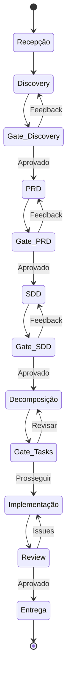

# 📋 Workflow: Novo Projeto

> **Tipo:** Workflow Principal
> **Versão:** 1.0.0
> **Última atualização:** 2026-06-06
> **Agente responsável:** Orquestrador

---

## Visão Geral

Este workflow descreve o fluxo completo para a criação de um novo projeto de software, desde a solicitação inicial do usuário até a entrega do código revisado. Cada passo inclui critérios de entrada, ações do agente, artefatos produzidos e gates de aprovação.

```
Recepção → Discovery → PRD → SDD → Decomposição → Implementação → Review → Entrega
    │          │         │      │         │              │            │         │
    ▼          ▼         ▼      ▼         ▼              ▼            ▼         ▼
  Setup    Entrevista  Doc.   Arq.    Tarefas         Código      Qualidade  Deploy
           Adaptativa  Req.   Técnica  Priorizadas    + Testes    + Segur.
```

---

## Passo 1: Recepção

### Gatilho
O usuário envia uma mensagem contendo a intenção de iniciar um novo projeto. Exemplos:
- `"Novo projeto: aplicativo de delivery para pets"`
- `"Quero criar um SaaS de gestão financeira"`
- `"Preciso de um sistema de agendamento online"`

### Ações do Orquestrador

1. **Extrair o nome do projeto** da mensagem do usuário
   - Sanitizar o nome para uso em diretórios (sem espaços, caracteres especiais)
   - Exemplo: `"Aplicativo de Delivery para Pets"` → `delivery-pets`

2. **Criar a estrutura de diretórios:**
   ```
   output/{nome-projeto}/
   ├── .estado.yaml          # Estado do projeto (gerenciado pelo Orquestrador)
   ├── interview-notes.md    # (será criado pelo Discovery)
   ├── prd.md                # (será criado pelo PRD Writer)
   ├── sdd.md                # (será criado pelo SDD Architect)
   └── tasks.md              # (será criado pelo Task Decomposer)
   ```

3. **Inicializar o arquivo de estado** `.estado.yaml`:
   ```yaml
   projeto: {nome-projeto}
   nome_display: "{Nome Original do Projeto}"
   descricao_inicial: "{mensagem original do usuário}"
   criado_em: "{timestamp ISO 8601}"
   fase_atual: recepção
   historico: []
   feedback_log: []
   ```

4. **Apresentar o fluxo ao usuário:**

   ```markdown
   ## 🚀 Novo Projeto: {Nome do Projeto}

   Excelente! Vou conduzir o desenvolvimento completo do seu projeto
   seguindo o ciclo de vida SDLC. Aqui está o que faremos juntos:

   | # | Fase | O que acontece | Artefato |
   |---|------|----------------|----------|
   | 1 | 🔍 Discovery | Entrevista para entender seu projeto | `interview-notes.md` |
   | 2 | 📋 PRD | Documento de requisitos do produto | `prd.md` |
   | 3 | 🏗️ SDD | Design técnico e arquitetura | `sdd.md` |
   | 4 | 📝 Tasks | Decomposição em tarefas | `tasks.md` |
   | 5 | 💻 Implementação | Código + testes | Código-fonte |
   | 6 | 🔍 Review | Revisão de qualidade | Review report |

   > Em cada fase, você terá a oportunidade de **revisar e aprovar**
   > o artefato antes de prosseguirmos.

   Vamos começar com a **fase de Discovery**! 🔍
   ```

### Critérios de Saída
- [x] Diretório do projeto criado
- [x] Arquivo `.estado.yaml` inicializado
- [x] Usuário informado sobre o fluxo
- [x] Pronto para invocar o agente Discovery

---

## Passo 2: Discovery (Entrevista)

### Critérios de Entrada
- Diretório `output/{nome-projeto}/` existe
- Não existe `output/{nome-projeto}/interview-notes.md`
- Ou: arquivo existe mas com `status: pendente` (re-discovery)

### Ações do Orquestrador

1. **Preparar contexto para o Discovery:**
   ```yaml
   agente: discovery
   projeto: {nome-projeto}
   descricao_inicial: "{mensagem original do usuário}"
   contexto_existente: "{qualquer informação já fornecida}"
   output_esperado: "output/{nome-projeto}/interview-notes.md"
   ```

2. **Invocar o agente Discovery** com o contexto preparado

3. **Aguardar conclusão da entrevista** — o Discovery conduz a entrevista diretamente com o usuário

### Agente Responsável: Discovery

O agente Discovery:
- Conduz uma entrevista **adaptativa** com o usuário (veja [AGENT.md](../../discovery/AGENT.md))
- Pula perguntas cujas respostas já foram fornecidas no contexto
- Agrupa perguntas quando possível (máximo 3 por mensagem)
- Faz follow-ups inteligentes baseados nas respostas
- Identifica gaps e ambiguidades

### Artefato Produzido

**Arquivo:** `output/{nome-projeto}/interview-notes.md`

**Estrutura esperada:**
```markdown
---
status: pendente
agente: discovery
criado_em: "{timestamp}"
---

# Notas da Entrevista — {Nome do Projeto}

## Resumo Executivo
{3 frases resumindo o projeto}

## Bloco 1: Visão e Problema
...

## Bloco 2: Funcionalidades
...

## Bloco 3: Técnico
...

## Bloco 4: Negócio e Sucesso
...

## Bloco 5: Contexto Adicional
...

## Decisões Implícitas Identificadas
...

## Gaps e Ambiguidades
...

## Recomendações do Agente
...
```

### 🔒 Gate de Aprovação

O Orquestrador apresenta o artefato ao usuário:

```markdown
## 🔒 Gate de Aprovação — Notas da Entrevista

A entrevista foi concluída e as notas foram organizadas.

📄 **Arquivo:** `output/{nome-projeto}/interview-notes.md`

### Resumo
{resumo executivo do interview-notes.md}

### Gaps Identificados
{lista de gaps, se houver}

---

Por favor, revise as notas e responda:
- ✅ **"Aprovado"** — as notas estão corretas e completas
- 🔄 **"Feedback: [comentário]"** — algo precisa ser ajustado
- ➕ **"Adicionar: [informação]"** — quero complementar algo
```

### Fluxos Possíveis

```
Aprovado ──────────────────────→ Passo 3 (PRD)
                                      │
Feedback ──→ Reenviar ao Discovery ──→ Atualizar interview-notes.md ──→ Novo Gate
                                      │
Adicionar ──→ Anexar ao interview-notes.md ──→ Novo Gate
```

### Critérios de Saída
- [x] `interview-notes.md` existe e está completo
- [x] Status do artefato: `aprovado`
- [x] Usuário validou as notas explicitamente
- [x] `.estado.yaml` atualizado com histórico da fase

---

## Passo 3: PRD (Documento de Requisitos)

### Critérios de Entrada
- `output/{nome-projeto}/interview-notes.md` existe com `status: aprovado`
- Não existe `output/{nome-projeto}/prd.md`
- Ou: arquivo existe mas com `status: pendente` (re-escrita)

### Ações do Orquestrador

1. **Preparar contexto para o PRD Writer:**
   ```yaml
   agente: prd-writer
   projeto: {nome-projeto}
   input: "output/{nome-projeto}/interview-notes.md"
   template: "templates/prd.md"
   output_esperado: "output/{nome-projeto}/prd.md"
   contexto_adicional: "{feedback do usuário, se houver}"
   ```

2. **Invocar o agente PRD Writer**

3. **Verificar qualidade do output** antes de apresentar ao usuário:
   - Todas as seções do template preenchidas?
   - Métricas são mensuráveis (SMART)?
   - Fora de escopo tem mínimo 3 itens?
   - Documento está entre 2-6 páginas?

### Agente Responsável: PRD Writer

O agente PRD Writer:
- Lê `interview-notes.md` completamente
- Segue o template em `templates/prd.md`
- Identifica e lista pendências/gaps
- Transforma informações vagas em requisitos específicos
- Produz user stories com critérios de aceitação

### Artefato Produzido

**Arquivo:** `output/{nome-projeto}/prd.md`

**Seções obrigatórias:**
1. Visão geral do produto
2. Problema e contexto
3. Público-alvo e personas
4. Requisitos funcionais (user stories com critérios de aceitação)
5. Requisitos não-funcionais
6. Fora de escopo
7. Métricas de sucesso (SMART)
8. Riscos e mitigações
9. Timeline e milestones
10. Pendências e decisões em aberto

### 🔒 Gate de Aprovação

```markdown
## 🔒 Gate de Aprovação — PRD

O Documento de Requisitos do Produto foi elaborado.

📄 **Arquivo:** `output/{nome-projeto}/prd.md`

### Resumo
- **Problema:** {problema definido}
- **Público-alvo:** {persona principal}
- **Features principais:** {lista de 3-5 features}
- **Métricas de sucesso:** {2-3 métricas}
- **Pendências:** {contagem de pendências}

---

> ⚠️ **Importante:** O PRD aprovado será a base para toda a
> arquitetura técnica. Revise com atenção!

Por favor, revise o PRD e responda:
- ✅ **"Aprovado"** — o PRD está correto e completo
- 🔄 **"Feedback: [comentário]"** — algo precisa ser ajustado
```

### Critérios de Saída
- [x] `prd.md` existe e atende todos os critérios de qualidade
- [x] Status do artefato: `aprovado`
- [x] Usuário aprovou o PRD explicitamente
- [x] `.estado.yaml` atualizado

---

## Passo 4: SDD (Design do Sistema)

### Critérios de Entrada
- `output/{nome-projeto}/prd.md` existe com `status: aprovado`
- Não existe `output/{nome-projeto}/sdd.md`

### Ações do Orquestrador

1. **Preparar contexto para o SDD Architect:**
   ```yaml
   agente: sdd-architect
   projeto: {nome-projeto}
   input_primario: "output/{nome-projeto}/prd.md"
   input_secundario: "output/{nome-projeto}/interview-notes.md"
   template: "templates/sdd.md"
   output_esperado: "output/{nome-projeto}/sdd.md"
   ```

2. **Invocar o agente SDD Architect**

3. **Verificar qualidade do output:**
   - Diagramas de arquitetura presentes?
   - Stack tecnológica justificada?
   - Modelos de dados definidos?
   - APIs especificadas?
   - Decisões arquiteturais documentadas (ADRs)?

### Agente Responsável: SDD Architect

O agente SDD Architect:
- Lê o PRD aprovado como fonte primária
- Consulta as notas de entrevista para contexto técnico
- Propõe arquitetura com justificativas
- Define modelos de dados, APIs e integrações
- Documenta decisões arquiteturais como ADRs
- Inclui diagramas (Mermaid)

### Artefato Produzido

**Arquivo:** `output/{nome-projeto}/sdd.md`

**Seções obrigatórias:**
1. Visão geral da arquitetura (com diagrama)
2. Stack tecnológica (com justificativas)
3. Estrutura do projeto (diretórios e módulos)
4. Modelos de dados (schemas/entidades)
5. APIs e contratos (endpoints, payloads)
6. Integrações externas
7. Estratégia de autenticação e autorização
8. Decisões arquiteturais (ADRs)
9. Considerações de infraestrutura e deploy
10. Plano de testes (estratégia)

### 🔒 Gate de Aprovação

```markdown
## 🔒 Gate de Aprovação — SDD

O Design do Sistema foi elaborado.

📄 **Arquivo:** `output/{nome-projeto}/sdd.md`

### Resumo da Arquitetura
- **Tipo:** {monolito | microsserviços | serverless | ...}
- **Stack:** {frontend} + {backend} + {banco de dados}
- **Integrações:** {lista de integrações}
- **Deploy:** {estratégia de deploy}

### Decisões Arquiteturais Principais
{lista de ADRs}

---

> ⚠️ **Importante:** O SDD aprovado definirá como o código será
> estruturado. Mudanças após essa fase são custosas.

Por favor, revise o SDD e responda:
- ✅ **"Aprovado"** — a arquitetura está adequada
- 🔄 **"Feedback: [comentário]"** — algo precisa ser ajustado
```

### Critérios de Saída
- [x] `sdd.md` existe e atende todos os critérios
- [x] Status do artefato: `aprovado`
- [x] Usuário aprovou a arquitetura explicitamente
- [x] `.estado.yaml` atualizado

---

## Passo 5: Decomposição em Tasks

### Critérios de Entrada
- `output/{nome-projeto}/sdd.md` existe com `status: aprovado`
- Não existe `output/{nome-projeto}/tasks.md`

### Ações do Orquestrador

1. **Preparar contexto para o Task Decomposer:**
   ```yaml
   agente: task-decomposer
   projeto: {nome-projeto}
   input_primario: "output/{nome-projeto}/sdd.md"
   input_secundario: "output/{nome-projeto}/prd.md"
   output_esperado: "output/{nome-projeto}/tasks.md"
   ```

2. **Invocar o agente Task Decomposer**

3. **Verificar qualidade:**
   - Todas as tasks têm critérios de aceitação?
   - Dependências entre tasks estão mapeadas?
   - Estimativas de esforço presentes?
   - Prioridades definidas (P0, P1, P2)?

### Agente Responsável: Task Decomposer

O agente Task Decomposer:
- Lê o SDD como fonte primária
- Referencia o PRD para critérios de aceitação
- Decompõe a implementação em tasks atômicas e implementáveis
- Define dependências, prioridades e estimativas
- Agrupa tasks em milestones/sprints lógicos

### Artefato Produzido

**Arquivo:** `output/{nome-projeto}/tasks.md`

**Estrutura esperada:**
```markdown
# Tasks — {Nome do Projeto}

## Milestone 1: {nome}
### Task 1.1: {título}
- **Prioridade:** P0
- **Estimativa:** 2h
- **Dependências:** nenhuma
- **Critérios de aceitação:**
  - [ ] ...
- **Arquivos envolvidos:** ...
- **Status:** pendente
```

### 🔒 Gate de Aprovação (Opcional)

> Este gate é **opcional**. O Orquestrador apresenta as tasks e pergunta se o usuário deseja revisar as prioridades, mas pode prosseguir automaticamente se o usuário preferir.

```markdown
## 📝 Decomposição de Tasks Concluída

📄 **Arquivo:** `output/{nome-projeto}/tasks.md`

### Resumo
- **Total de tasks:** {N}
- **P0 (críticas):** {n}
- **P1 (importantes):** {n}
- **P2 (desejáveis):** {n}
- **Milestones:** {lista}

Deseja revisar as prioridades antes de iniciar a implementação?
- ✅ **"Prosseguir"** — iniciar implementação na ordem sugerida
- 🔄 **"Revisar"** — ajustar prioridades ou escopo
```

### Critérios de Saída
- [x] `tasks.md` existe com tasks atômicas e priorizadas
- [x] Dependências mapeadas
- [x] Usuário informado (aprovação explícita é opcional)
- [x] `.estado.yaml` atualizado

---

## Passo 6: Implementação

### Critérios de Entrada
- `output/{nome-projeto}/tasks.md` existe
- Pelo menos uma task com `status: pendente`

### Ações do Orquestrador

1. **Selecionar a próxima task** respeitando:
   - Ordem de prioridade (P0 primeiro)
   - Dependências resolvidas
   - Tasks sem bloqueios

2. **Preparar contexto para o Implementer:**
   ```yaml
   agente: implementer
   projeto: {nome-projeto}
   task: "{task-id}: {título}"
   contexto:
     sdd: "output/{nome-projeto}/sdd.md"
     prd: "output/{nome-projeto}/prd.md"
     tasks: "output/{nome-projeto}/tasks.md"
     criterios_aceitacao: [...]
   ```

3. **Invocar o agente Implementer**

4. **Ao finalizar a task:**
   - Atualizar `status: done` no `tasks.md`
   - Verificar se há testes automatizados
   - Selecionar próxima task (loop)

### Agente Responsável: Implementer

O agente Implementer para cada task:
- Lê a especificação da task e o contexto do SDD
- Implementa o código seguindo os padrões definidos
- Escreve testes (unitários e/ou integração)
- Comita as mudanças com mensagens descritivas
- Reporta conclusão ao Orquestrador

### Fluxo do Loop de Implementação

```
┌─────────────────────────────────────────┐
│         Selecionar próxima task          │
└──────────────┬──────────────────────────┘
               │
               ▼
        ┌──────────────┐
        │  Implementar  │
        │  (código)     │
        └──────┬───────┘
               │
               ▼
        ┌──────────────┐
        │  Escrever    │
        │  testes      │
        └──────┬───────┘
               │
               ▼
        ┌──────────────┐
        │  Executar    │
        │  testes      │──── Falhou? → Corrigir → Executar novamente
        └──────┬───────┘
               │ Passou
               ▼
        ┌──────────────┐
        │  Comitar     │
        │  mudanças    │
        └──────┬───────┘
               │
               ▼
        ┌──────────────┐
        │  Atualizar   │
        │  tasks.md    │
        └──────┬───────┘
               │
               ▼
      ┌────────────────────┐
      │ Há tasks restantes?│
      └────┬───────────┬───┘
           │ Sim       │ Não
           ▼           ▼
        [Voltar]    [Passo 7]
```

### Critérios de Saída
- [x] Todas as tasks P0 implementadas
- [x] Testes passando
- [x] Código comitado
- [x] `tasks.md` atualizado com status `done`

---

## Passo 7: Review

### Critérios de Entrada
- Existem commits de implementação sem review
- Ou: milestone concluído

### Ações do Orquestrador

1. **Preparar contexto para o Reviewer:**
   ```yaml
   agente: reviewer
   projeto: {nome-projeto}
   escopo: "{milestone ou PR}"
   checklists:
     - qualidade-codigo
     - seguranca
     - performance
     - acessibilidade (se aplicável)
   contexto:
     prd: "output/{nome-projeto}/prd.md"
     sdd: "output/{nome-projeto}/sdd.md"
   ```

2. **Invocar o agente Reviewer**

3. **Processar resultado:**
   - Se aprovado → milestone concluído
   - Se com issues → criar tasks de correção e voltar ao Passo 6

### Agente Responsável: Reviewer

O agente Reviewer:
- Analisa o código produzido
- Aplica checklists de qualidade, segurança e performance
- Verifica aderência ao SDD e PRD
- Identifica bugs, vulnerabilidades e code smells
- Produz relatório de review com ações necessárias

### Checklists Aplicados

#### Qualidade de Código
- [ ] Código segue os padrões definidos no SDD
- [ ] Funções com responsabilidade única
- [ ] Naming conventions consistentes
- [ ] Sem código duplicado
- [ ] Tratamento de erros adequado
- [ ] Logs informativos nos pontos críticos

#### Segurança
- [ ] Sem credenciais hardcoded
- [ ] Inputs validados e sanitizados
- [ ] SQL injection prevenido (queries parametrizadas)
- [ ] XSS prevenido (output encoding)
- [ ] Autenticação e autorização implementadas
- [ ] Dados sensíveis criptografados

#### Performance
- [ ] Queries otimizadas (sem N+1)
- [ ] Caching implementado onde apropriado
- [ ] Assets otimizados (imagens, bundles)
- [ ] Lazy loading onde aplicável

### Fluxo de Resultado

```
Review Report
    │
    ├── ✅ Aprovado ──────────→ Milestone concluído
    │                              │
    │                              ▼
    │                    ┌─────────────────────┐
    │                    │ Mais milestones?     │
    │                    │ Sim → Passo 6        │
    │                    │ Não → Projeto Entrega│
    │                    └─────────────────────┘
    │
    └── ⚠️ Issues encontradas
            │
            ▼
    ┌─────────────────────────┐
    │ Criar tasks de correção │
    │ no tasks.md             │
    └──────────┬──────────────┘
               │
               ▼
          [Passo 6: Implementar correções]
```

### Critérios de Saída
- [x] Review report produzido
- [x] Todas as issues críticas resolvidas
- [x] Código aprovado pelo Reviewer

---

## Entrega Final

Quando todas as tasks estão `done` e o review está aprovado:

```markdown
## 🎉 Projeto Concluído: {Nome do Projeto}

### Resumo da Entrega
- **Duração total:** {tempo}
- **Tasks implementadas:** {N}/{N}
- **Testes:** {N} passando
- **Issues de review:** {N} resolvidas

### Artefatos Produzidos
- 📄 `interview-notes.md` — Notas da entrevista
- 📋 `prd.md` — Requisitos do produto
- 🏗️ `sdd.md` — Design do sistema
- 📝 `tasks.md` — Histórico de tasks
- 💻 Código-fonte implementado
- 🔍 Review report

### Próximos Passos Sugeridos
1. {sugestão 1}
2. {sugestão 2}
3. {sugestão 3}
```

---

## Referência Rápida: Estados e Transições


