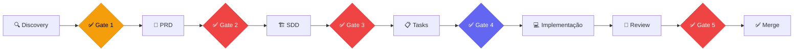
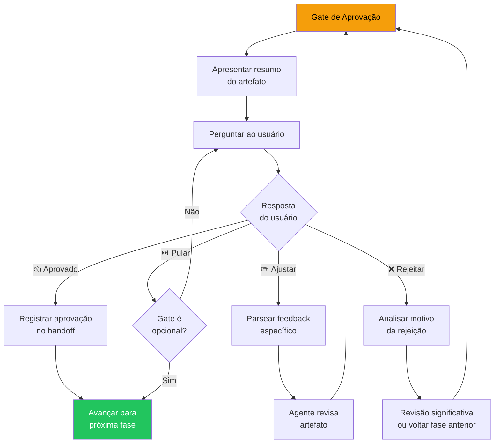

# Gates de Aprovação Humana

> **Propósito**: Garantir que o humano mantenha controle e autoridade sobre o produto em pontos críticos do ciclo de vida, evitando que agentes avancem com suposições não validadas.

---

## 1. Princípio Fundamental

> **O humano é a autoridade final sobre o produto.**
>
> Agentes são ferramentas poderosas, mas não são donos do produto. Em pontos críticos, o sistema **PARA** e aguarda decisão humana explícita. Nenhum agente pode assumir aprovação.

---

## 2. Visão Geral dos Gates



| Gate | Fase | Obrigatório? | Classificação |
|------|------|:------------:|---------------|
| **Gate 1** | Após Discovery | ✅ Sim | Validação de Entendimento |
| **Gate 2** | Após PRD | ✅ **Sim (Crítico)** | Aprovação de Requisitos |
| **Gate 3** | Após SDD | ✅ **Sim (Crítico)** | Aprovação de Arquitetura |
| **Gate 4** | Após Tasks | ⚡ Opcional | Validação de Prioridades |
| **Gate 5** | Antes de Merge | ✅ **Sim (Crítico)** | Aprovação de Código |

---

## 3. Detalhamento por Gate

---

### Gate 1: Validação do Entendimento

**Quando**: Após a entrevista de Discovery ser concluída

**Classificação**: ✅ Obrigatório

**Objetivo**: Confirmar que o agente entendeu corretamente o projeto, as necessidades e as restrições do usuário antes de investir tempo na documentação formal.

#### O que mostrar ao usuário

```markdown
## ✅ Gate 1 — Validação do Entendimento

Concluí a entrevista de discovery. Antes de avançar para o PRD, preciso 
que você valide se entendi seu projeto corretamente.

### Resumo do Entendimento

**Projeto**: [nome/descrição em 1 frase]
**Problema**: [problema que resolve]
**Público-alvo**: [quem vai usar]
**Funcionalidades principais**: 
1. [funcionalidade 1]
2. [funcionalidade 2]
3. [funcionalidade 3]

**Restrições identificadas**:
- [restrição 1]
- [restrição 2]

**Fora de escopo (para v1)**:
- [item 1]
- [item 2]

### Pergunta

✅ Este entendimento está correto? Posso prosseguir para o PRD?

**Opções**:
- 👍 **Aprovado** — Entendimento está correto, prosseguir para o PRD
- ✏️ **Ajustar** — Quase lá, mas preciso corrigir: [descreva ajustes]
- 🔄 **Refazer** — Entendimento precisa de revisão significativa
```

#### Como pedir feedback

- Apresentar resumo estruturado (não o documento completo de Discovery)
- Usar linguagem clara e não-técnica
- Oferecer opções claras: Aprovado / Ajustar / Refazer
- Destacar pontos que precisam de confirmação explícita

#### O que fazer com feedback negativo

| Tipo de Feedback | Ação |
|-----------------|------|
| **Ajustar** | Incorporar ajustes no documento de Discovery e re-apresentar Gate 1 |
| **Refazer** | Retomar entrevista com foco nos pontos incorretos |

---

### Gate 2: Aprovação do PRD

**Quando**: Após o PRD ser gerado pelo PRD Writer

**Classificação**: ✅ **Obrigatório (Crítico)**

**Objetivo**: Garantir que os requisitos documentados refletem fielmente o que o usuário quer construir. O SDD será baseado integralmente neste PRD — erros aqui se propagam para todo o projeto.

#### O que mostrar ao usuário

```markdown
## ✅ Gate 2 — Aprovação do PRD

O PRD (Product Requirements Document) foi gerado. Este documento define 
O QUE será construído. A arquitetura técnica (COMO) só será iniciada 
após sua aprovação.

### Resumo do PRD

**Visão do Produto**: [1-2 frases]

**Personas**: 
- [Persona 1]: [descrição breve]
- [Persona 2]: [descrição breve]

**Requisitos Funcionais** (top 5):
1. [RF01] [descrição]
2. [RF02] [descrição]
3. [RF03] [descrição]
4. [RF04] [descrição]
5. [RF05] [descrição]

**Requisitos Não-Funcionais**:
- Performance: [meta]
- Segurança: [requisito]
- Disponibilidade: [meta]

**Métricas de Sucesso**:
- [Métrica 1]: [alvo]
- [Métrica 2]: [alvo]

**Escopo v1**: [resumo do que entra]
**Fora de Escopo**: [resumo do que NÃO entra]

📄 **PRD completo**: [caminho/para/prd.md]

### Pergunta

✅ O PRD está correto e completo? Posso prosseguir para a arquitetura?

**Opções**:
- 👍 **Aprovado** — PRD está correto, prosseguir para o SDD
- ✏️ **Ajustar** — Preciso de mudanças: [descreva o que alterar]
- ❌ **Rejeitar** — PRD precisa de revisão significativa: [descreva motivo]
```

#### Como pedir feedback

- Apresentar resumo executivo do PRD (não o documento inteiro)
- Destacar decisões de escopo (o que entra vs. o que fica fora)
- Chamar atenção para métricas de sucesso — elas guiarão todo o projeto
- Linkar para o PRD completo para leitura detalhada

#### O que fazer com feedback negativo

| Tipo de Feedback | Ação |
|-----------------|------|
| **Ajustar** | PRD Writer incorpora mudanças e re-apresenta Gate 2 |
| **Rejeitar** | PRD Writer refaz seções problemáticas, possivelmente consultando Discovery novamente |

#### ⚠️ Regra Crítica

> **O SDD NÃO pode ser iniciado sem aprovação explícita do Gate 2.**
> Se o usuário não responder, o sistema aguarda. Não assumir aprovação por silêncio.

---

### Gate 3: Aprovação do SDD

**Quando**: Após o SDD ser gerado pelo SDD Architect

**Classificação**: ✅ **Obrigatório (Crítico)**

**Objetivo**: Validar que a arquitetura técnica proposta é viável, adequada e alinhada com as restrições do projeto. Tasks e implementação serão baseadas integralmente neste SDD.

#### O que mostrar ao usuário

```markdown
## ✅ Gate 3 — Aprovação do SDD

O SDD (Software Design Document) foi gerado. Este documento define 
COMO o sistema será construído. A decomposição em tasks só será 
iniciada após sua aprovação.

### Resumo do SDD

**Stack Tecnológica**: 
- Frontend: [tecnologia]
- Backend: [tecnologia]
- Banco de Dados: [tecnologia]
- Infra: [tecnologia]

**Arquitetura**: [tipo — monolito, microserviços, serverless, etc.]

**Componentes Principais**:
1. [Componente 1]: [responsabilidade]
2. [Componente 2]: [responsabilidade]
3. [Componente 3]: [responsabilidade]

**Trade-offs Documentados**:
- [Decisão]: [opção escolhida] vs. [alternativa descartada] — [motivo]

**Estratégia de Testes**: [abordagem]
**Plano de Rollout**: [fases]

📄 **SDD completo**: [caminho/para/sdd.md]

### Pergunta

✅ A arquitetura proposta está adequada? Posso decompor em tasks?

**Opções**:
- 👍 **Aprovado** — Arquitetura está adequada, prosseguir para tasks
- ✏️ **Ajustar** — Preciso de mudanças técnicas: [descreva]
- ❌ **Rejeitar** — Arquitetura precisa de revisão: [descreva motivo]
```

#### Como pedir feedback

- Apresentar decisões técnicas de forma acessível (mesmo para não-técnicos)
- Destacar trade-offs — o que se ganha e o que se perde com cada escolha
- Se o usuário não for técnico, simplificar e perguntar sobre impactos de negócio
- Linkar para o SDD completo com diagramas

#### O que fazer com feedback negativo

| Tipo de Feedback | Ação |
|-----------------|------|
| **Ajustar** | SDD Architect modifica componentes específicos e re-apresenta Gate 3 |
| **Rejeitar** | SDD Architect reavalia arquitetura, possivelmente propõe alternativas |

#### ⚠️ Regra Crítica

> **Tasks NÃO podem ser decompostas sem aprovação explícita do Gate 3.**
> Sem SDD aprovado, não há base confiável para planejamento de implementação.

---

### Gate 4: Validação de Prioridades

**Quando**: Após a decomposição em tasks pelo Task Decomposer

**Classificação**: ⚡ **Opcional**

**Objetivo**: Permitir que o usuário ajuste prioridades, reordene tasks ou exclua itens antes da implementação. Útil quando o escopo é grande ou o prazo é curto.

#### O que mostrar ao usuário

```markdown
## ✅ Gate 4 — Validação de Prioridades (Opcional)

As tasks foram decompostas a partir do SDD aprovado. Antes de iniciar 
a implementação, você pode revisar e ajustar prioridades.

### Tasks Planejadas

| # | Task | Estimativa | Prioridade | Dependências |
|---|------|-----------|------------|--------------|
| 1 | [task 1] | 2h | Alta | Nenhuma |
| 2 | [task 2] | 3h | Alta | Task 1 |
| 3 | [task 3] | 4h | Média | Nenhuma |
| ... | ... | ... | ... | ... |

**Total**: [N] tasks | **Estimativa total**: [X]h

### Pergunta

✅ Deseja ajustar prioridades ou a ordem de implementação?

**Opções**:
- 👍 **Aprovado** — Prioridades estão corretas, iniciar implementação
- ✏️ **Ajustar** — Mudar prioridades: [descreva ajustes]
- ⏭️ **Pular** — Confio na priorização, seguir em frente
```

#### Como pedir feedback

- Apresentar tabela resumida com estimativas e dependências
- Destacar o caminho crítico (tasks que bloqueiam outras)
- Indicar tasks que podem ser paralelizadas
- Oferecer opção de pular (gate é opcional)

#### O que fazer com feedback negativo

| Tipo de Feedback | Ação |
|-----------------|------|
| **Ajustar** | Task Decomposer reordena conforme solicitado |

---

### Gate 5: Aprovação de PR (Antes de Merge)

**Quando**: Após review do PR pelo Reviewer

**Classificação**: ✅ **Obrigatório (Crítico)**

**Objetivo**: Garantir que código só entre na base principal após revisão de qualidade, segurança e funcionalidade. Este é o último gate antes da entrega.

#### O que mostrar ao usuário

```markdown
## ✅ Gate 5 — Aprovação de PR

O código foi implementado e revisado. Antes do merge, confirme 
que o resultado atende suas expectativas.

### Resumo do PR

**Task implementada**: [nome da task]
**Arquivos modificados**: [N] arquivos | [+X / -Y] linhas
**Testes**: [N] testes adicionados | [todos passando ✅ | falhas ❌]

### Resultado do Review

**Status**: [Aprovado ✅ | Aprovado com observações ⚠️]

**Checklist de Qualidade**:
- [x] Funcionalidade correta
- [x] Testes incluídos e passando
- [x] Sem secrets ou credenciais hardcoded
- [x] Lint e build passam
- [x] PR < 400 linhas
- [x] Descrição com "porquê"

**Observações do Reviewer**:
- [observação 1]
- [observação 2]

### Pergunta

✅ Posso mergear este PR?

**Opções**:
- 👍 **Merge** — Código está bom, mergear
- ✏️ **Ajustar** — Preciso de mudanças antes do merge: [descreva]
- ❌ **Rejeitar** — Não mergear: [descreva motivo]
```

#### Como pedir feedback

- Mostrar resumo conciso do que foi implementado
- Incluir resultado do checklist de qualidade
- Destacar observações do Reviewer
- Se houver débito técnico aceito, ser transparente

#### O que fazer com feedback negativo

| Tipo de Feedback | Ação |
|-----------------|------|
| **Ajustar** | Implementer faz mudanças e submete novo review |
| **Rejeitar** | Implementer revisa abordagem, possivelmente consulta SDD novamente |

#### ⚠️ Regra Crítica

> **Código NÃO é mergeado sem aprovação explícita do Gate 5.**
> Review aprovado pelo agente Reviewer não substitui aprovação humana para merge.

---

## 4. Regras Gerais dos Gates

### Comportamento do Sistema nos Gates

| Regra | Descrição |
|-------|-----------|
| **Pausa obrigatória** | O sistema **PARA** em gates obrigatórios e aguarda resposta |
| **Sem timeout** | Gates não expiram — o sistema espera o tempo que for necessário |
| **Sem aprovação implícita** | Silêncio NÃO é aprovação. Sem resposta explícita, sem avanço |
| **Feedback é iterativo** | O usuário pode dar feedback múltiplas vezes até aprovar |
| **Registro obrigatório** | Toda aprovação e feedback são registrados no handoff |

### Contagem de Iterações

Para evitar loops infinitos:

- Após **3 iterações** de feedback no mesmo gate, o Orchestrator sugere:
  - Voltar à fase anterior para realinhamento
  - Agendar uma sessão focada para resolver as divergências
  - Simplificar o escopo para destravar o avanço

### Escalation

Se o usuário expressar frustração ou o gate travar:

1. Orchestrator reconhece a dificuldade
2. Propõe abordagem alternativa (ex: simplificar escopo, dividir entrega)
3. Nunca força aprovação — sempre busca alinhamento genuíno

---

## 5. Fluxo de Feedback Detalhado



---

<p align="center">
  <em>Gates existem para proteger o projeto. Respeite-os — eles são seu aliado, não seu obstáculo.</em>
</p>
