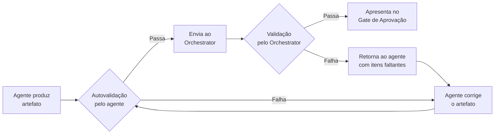
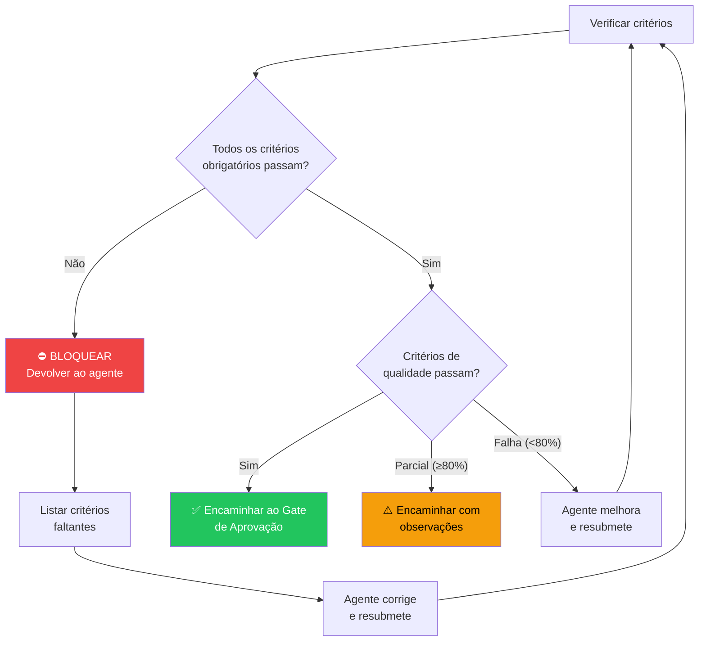

# Gates de Qualidade

> **Propósito**: Definir critérios mínimos e objetivos de qualidade para cada artefato produzido no ciclo de vida. Um artefato que não atende esses critérios **NÃO** deve ser apresentado ao usuário no gate de aprovação.

---

## 1. Princípio

> **Qualidade não é negociável.**
>
> Cada agente é responsável por garantir que seu artefato atenda todos os critérios de qualidade **antes** de enviá-lo ao Orchestrator. O Orchestrator valida os critérios antes de apresentar ao usuário. Artefatos incompletos são devolvidos ao agente para correção.

---

## 2. Processo de Validação



Cada artefato passa por **duas validações** antes de chegar ao usuário:

1. **Autovalidação** pelo agente que produziu o artefato
2. **Validação pelo Orchestrator** antes de apresentar no gate

---

## 3. Critérios por Artefato

---

### 3.1 📄 PRD — Product Requirements Document

**Agente responsável**: PRD Writer

#### Critérios Obrigatórios

| # | Critério | Descrição | Verificação |
|---|----------|-----------|-------------|
| P01 | **Visão do Produto** | Descrição clara do que é o produto e por que existe | Presente e em ≤3 frases |
| P02 | **Problema** | Problema que o produto resolve, com evidências ou contexto | Presente e específico |
| P03 | **Personas** | Ao menos 1 persona definida com nome, perfil e necessidades | ≥1 persona |
| P04 | **Requisitos Funcionais** | Lista de funcionalidades com IDs únicos (RF01, RF02...) | ≥3 requisitos |
| P05 | **Requisitos Não-Funcionais** | Performance, segurança, disponibilidade, acessibilidade | ≥2 requisitos |
| P06 | **Métricas de Sucesso** | Métricas mensuráveis com alvos numéricos | ≥2 métricas com números |
| P07 | **Escopo da v1** | O que entra na primeira versão | Lista explícita |
| P08 | **Fora de Escopo** | O que NÃO entra na primeira versão | Lista explícita (não pode estar vazia) |
| P09 | **Restrições** | Restrições técnicas, de prazo, orçamento ou regulatórias | Seção presente |
| P10 | **Priorização** | Funcionalidades priorizadas (MoSCoW, P0/P1/P2, ou similar) | Método de priorização definido |

#### Critérios de Qualidade

| # | Critério | Verificação |
|---|----------|-------------|
| PQ1 | Métricas são mensuráveis | Cada métrica tem um número alvo (ex: "tempo de resposta < 200ms", não "rápido") |
| PQ2 | Escopo é realista | Escopo é factível para o contexto (equipe, prazo, orçamento) |
| PQ3 | Sem ambiguidade | Requisitos são claros e verificáveis (evitar "deve ser intuitivo") |
| PQ4 | Rastreável | Cada requisito tem ID único para referência em outros artefatos |
| PQ5 | Consistente | Requisitos não se contradizem |

#### Checklist de Autovalidação

```markdown
## Autovalidação — PRD

- [ ] P01: Visão do produto clara e concisa
- [ ] P02: Problema bem definido com contexto
- [ ] P03: ≥1 persona com perfil detalhado
- [ ] P04: ≥3 requisitos funcionais com IDs
- [ ] P05: ≥2 requisitos não-funcionais
- [ ] P06: ≥2 métricas de sucesso com alvos numéricos
- [ ] P07: Escopo v1 explícito
- [ ] P08: Fora de escopo explícito (não vazio)
- [ ] P09: Restrições documentadas
- [ ] P10: Priorização definida
- [ ] PQ1: Todas as métricas são mensuráveis
- [ ] PQ2: Escopo é realista
- [ ] PQ3: Sem termos ambíguos
- [ ] PQ4: IDs únicos em todos os requisitos
- [ ] PQ5: Sem contradições entre requisitos
```

---

### 3.2 🏗️ SDD — Software Design Document

**Agente responsável**: SDD Architect

#### Critérios Obrigatórios

| # | Critério | Descrição | Verificação |
|---|----------|-----------|-------------|
| S01 | **Referência ao PRD** | SDD referencia o PRD que o originou | Link/caminho presente |
| S02 | **Stack Tecnológica** | Tecnologias escolhidas com justificativa | Cada tecnologia com "porquê" |
| S03 | **Arquitetura de Alto Nível** | Diagrama da arquitetura (componentes e conexões) | ≥1 diagrama Mermaid ou equivalente |
| S04 | **Componentes** | Cada componente com responsabilidade e interfaces | ≥2 componentes definidos |
| S05 | **Modelo de Dados** | Schema principal com entidades e relações | Presente com campos e tipos |
| S06 | **APIs/Interfaces** | Endpoints ou interfaces entre componentes | ≥1 API definida |
| S07 | **Trade-offs** | Decisões técnicas com alternativas consideradas | ≥2 trade-offs documentados |
| S08 | **Estratégia de Testes** | Abordagem para testes (unit, integration, e2e) | Tipos e ferramentas definidos |
| S09 | **Plano de Rollout** | Como o sistema será implantado (fases, ordem) | ≥1 fase definida |
| S10 | **Segurança** | Considerações de segurança (auth, dados, OWASP) | Seção presente |

#### Critérios de Qualidade

| # | Critério | Verificação |
|---|----------|-------------|
| SQ1 | Trade-offs com "porquê" | Cada decisão explica a alternativa descartada e o motivo |
| SQ2 | Diagramas legíveis | Diagramas usam notação padrão e são auto-explicativos |
| SQ3 | Cobertura completa | Todo requisito funcional do PRD é endereçado pela arquitetura |
| SQ4 | Requisitos não-funcionais | Estratégia técnica para atender cada requisito não-funcional |
| SQ5 | Sem over-engineering | Arquitetura proporcional à complexidade do projeto |
| SQ6 | Dependências explícitas | Bibliotecas e serviços externos listados com versões |

#### Checklist de Autovalidação

```markdown
## Autovalidação — SDD

- [ ] S01: Referência ao PRD aprovado
- [ ] S02: Stack tecnológica com justificativas
- [ ] S03: ≥1 diagrama de arquitetura
- [ ] S04: ≥2 componentes com responsabilidades
- [ ] S05: Modelo de dados com entidades e tipos
- [ ] S06: ≥1 API/interface definida
- [ ] S07: ≥2 trade-offs documentados
- [ ] S08: Estratégia de testes definida
- [ ] S09: Plano de rollout com fases
- [ ] S10: Considerações de segurança
- [ ] SQ1: Trade-offs explicam "porquê"
- [ ] SQ2: Diagramas legíveis
- [ ] SQ3: Todos os requisitos do PRD cobertos
- [ ] SQ4: Estratégia para requisitos não-funcionais
- [ ] SQ5: Sem over-engineering
- [ ] SQ6: Dependências com versões
```

---

### 3.3 📋 Tasks — Decomposição de Tarefas

**Agente responsável**: Task Decomposer

#### Critérios Obrigatórios

| # | Critério | Descrição | Verificação |
|---|----------|-----------|-------------|
| T01 | **Referência ao SDD** | Tasks referenciam o SDD que as originou | Link/caminho presente |
| T02 | **Atomicidade** | Cada task é atômica — pode ser completada em uma sessão | Estimativa ≤4 horas |
| T03 | **Critério de Conclusão** | Cada task tem definição de "pronto" verificável | Presente e binário (sim/não) |
| T04 | **Dependências** | Dependências entre tasks são explícitas | Grafo de dependências |
| T05 | **Sem Ciclos** | Não existem dependências circulares | Grafo é acíclico (DAG) |
| T06 | **Priorização** | Tasks ordenadas por prioridade e dependência | Ordem numérica definida |
| T07 | **Estimativa** | Cada task tem estimativa de tempo | Estimativa em horas |
| T08 | **Escopo Claro** | Cada task descreve o que fazer e o que NÃO fazer | Descrição ≥2 frases |

#### Critérios de Qualidade

| # | Critério | Verificação |
|---|----------|-------------|
| TQ1 | Cobertura do SDD | Todas as funcionalidades do SDD estão cobertas por ≥1 task |
| TQ2 | Granularidade adequada | Tasks não são grandes demais (>4h) nem pequenas demais (<30min) |
| TQ3 | Paralelismo identificado | Tasks que podem ser feitas em paralelo estão marcadas |
| TQ4 | Caminho crítico | Sequência de tasks que define o tempo mínimo do projeto |
| TQ5 | IDs rastreáveis | Cada task tem ID único que referencia o componente do SDD |

#### Checklist de Autovalidação

```markdown
## Autovalidação — Tasks

- [ ] T01: Referência ao SDD aprovado
- [ ] T02: Todas as tasks ≤4 horas
- [ ] T03: Critério de conclusão verificável em cada task
- [ ] T04: Dependências explícitas
- [ ] T05: Sem dependências circulares (DAG)
- [ ] T06: Ordem de prioridade definida
- [ ] T07: Estimativa de tempo em cada task
- [ ] T08: Escopo descrito com ≥2 frases por task
- [ ] TQ1: Todas as funcionalidades do SDD cobertas
- [ ] TQ2: Granularidade entre 30min e 4h
- [ ] TQ3: Tasks paralelizáveis identificadas
- [ ] TQ4: Caminho crítico definido
- [ ] TQ5: IDs rastreáveis ao SDD
```

---

### 3.4 💻 Código — Implementação

**Agente responsável**: Implementer

#### Critérios Obrigatórios

| # | Critério | Descrição | Verificação |
|---|----------|-----------|-------------|
| C01 | **Referência à Task** | Código implementa uma task específica | ID da task referenciado |
| C02 | **Testes Incluídos** | Testes unitários e/ou de integração no mesmo PR | ≥1 arquivo de teste |
| C03 | **Sem Secrets** | Nenhuma chave, token, senha ou credencial hardcoded | Busca por padrões de secret |
| C04 | **Lint Passa** | Código passa no linter configurado sem warnings | Comando de lint com saída limpa |
| C05 | **Build Passa** | Projeto compila/builda sem erros | Comando de build com saída limpa |
| C06 | **Testes Passam** | Todos os testes passam (novos e existentes) | Saída do test runner sem falhas |
| C07 | **Documentação** | Funções públicas e APIs documentadas | Comentários/docstrings presentes |

#### Critérios de Qualidade

| # | Critério | Verificação |
|---|----------|-------------|
| CQ1 | Código segue padrões do projeto | Nomenclatura, estrutura de diretórios, patterns do SDD |
| CQ2 | Sem código morto | Nenhum código comentado ou não utilizado |
| CQ3 | Error handling | Erros tratados explicitamente (sem swallow silencioso) |
| CQ4 | Performance aceitável | Sem problemas óbvios de N+1, memory leaks, loops infinitos |
| CQ5 | Acessibilidade (se UI) | ARIA labels, contraste, navegação por teclado |
| CQ6 | Idempotência | Operações que podem ser repetidas não causam efeitos colaterais |

#### Checklist de Autovalidação

```markdown
## Autovalidação — Código

- [ ] C01: Referência à task (ID no commit/PR)
- [ ] C02: Testes incluídos no mesmo PR
- [ ] C03: Busca por secrets retorna zero resultados
- [ ] C04: `lint` passa sem warnings
- [ ] C05: `build` passa sem erros
- [ ] C06: `test` passa — todos os testes (novos + existentes)
- [ ] C07: Funções públicas documentadas
- [ ] CQ1: Segue padrões do projeto
- [ ] CQ2: Sem código morto
- [ ] CQ3: Erros tratados explicitamente
- [ ] CQ4: Sem problemas óbvios de performance
```

---

### 3.5 🔎 PR — Pull Request

**Agente responsável**: Implementer (criação) + Reviewer (revisão)

#### Critérios Obrigatórios

| # | Critério | Descrição | Verificação |
|---|----------|-----------|-------------|
| R01 | **Tamanho** | PR tem menos de 400 linhas de mudança | Contagem de linhas |
| R02 | **Descrição com "Porquê"** | Descrição explica a motivação, não só o que foi feito | Seção "Motivação" ou "Porquê" presente |
| R03 | **Testes no Mesmo PR** | Testes estão incluídos no PR (não em PR separado) | Arquivos de teste na diff |
| R04 | **Uma Preocupação** | PR endereça uma única task ou fix | Título referencia 1 task |
| R05 | **CI Verde** | Pipeline de CI passa completamente | Status checks passam |
| R06 | **Sem Conflitos** | PR não tem conflitos de merge | Git status limpo |

#### Critérios de Qualidade

| # | Critério | Verificação |
|---|----------|-------------|
| RQ1 | Título descritivo | Título segue padrão: `[TASK-XX] Breve descrição da mudança` |
| RQ2 | Checklist de review | Checklist de segurança preenchido pelo autor |
| RQ3 | Screenshots/evidência | Se UI, screenshots antes/depois incluídos |
| RQ4 | Breaking changes | Se houver, explicitamente documentados |
| RQ5 | Migration necessária? | Se houver mudança de schema, migration incluída |

#### Template de PR

```markdown
## [TASK-XX] Título da Mudança

### Motivação (Porquê)
[Por que esta mudança é necessária? Qual problema resolve?]

### O que foi feito
- [Item 1]
- [Item 2]
- [Item 3]

### Como testar
1. [Passo 1]
2. [Passo 2]
3. [Resultado esperado]

### Checklist do Autor
- [ ] Testes incluídos e passando
- [ ] Lint passa sem warnings
- [ ] Build passa sem erros
- [ ] Sem secrets hardcoded
- [ ] PR < 400 linhas
- [ ] Documentação atualizada (se aplicável)
- [ ] Sem breaking changes (ou documentados abaixo)

### Screenshots (se UI)
[Antes] | [Depois]

### Notas para o Reviewer
[Algo que o reviewer deve prestar atenção especial?]
```

#### Checklist de Autovalidação

```markdown
## Autovalidação — PR

- [ ] R01: PR < 400 linhas
- [ ] R02: Descrição inclui "Porquê"
- [ ] R03: Testes no mesmo PR
- [ ] R04: PR endereça uma única task
- [ ] R05: CI verde
- [ ] R06: Sem conflitos de merge
- [ ] RQ1: Título segue padrão
- [ ] RQ2: Checklist do autor preenchido
```

---

## 4. Matriz de Qualidade — Resumo

| Artefato | Critérios Obrigatórios | Critérios de Qualidade | Total |
|----------|:---------------------:|:---------------------:|:-----:|
| PRD | 10 | 5 | 15 |
| SDD | 10 | 6 | 16 |
| Tasks | 8 | 5 | 13 |
| Código | 7 | 6 | 13 |
| PR | 6 | 5 | 11 |
| **Total** | **41** | **27** | **68** |

---

## 5. Tratamento de Falhas de Qualidade

### O que acontece quando um critério obrigatório não é atendido?



### Regras

| Situação | Ação |
|----------|------|
| Critério **obrigatório** faltando | ⛔ Bloquear — artefato não avança |
| Critérios de qualidade ≥80% atendidos | ⚠️ Avança com observações para o usuário |
| Critérios de qualidade <80% atendidos | Devolver ao agente para melhoria |
| Mesmo critério falha 3 vezes seguidas | Orchestrator intervém para diagnosticar |

---

## 6. Evolução dos Critérios

Estes critérios são um baseline. Conforme o projeto evolui:

- **Adicione** critérios específicos do domínio (ex: conformidade LGPD, acessibilidade WCAG)
- **Ajuste** limiares se necessário (ex: cobertura de testes >90% para fintech)
- **Documente** adições no próprio arquivo para que todos os agentes atualizem

> ⚠️ **Nunca remova critérios obrigatórios sem justificativa documentada.**

---

<p align="center">
  <em>Qualidade é o que sobra quando você remove tudo que pode dar errado.</em>
</p>
