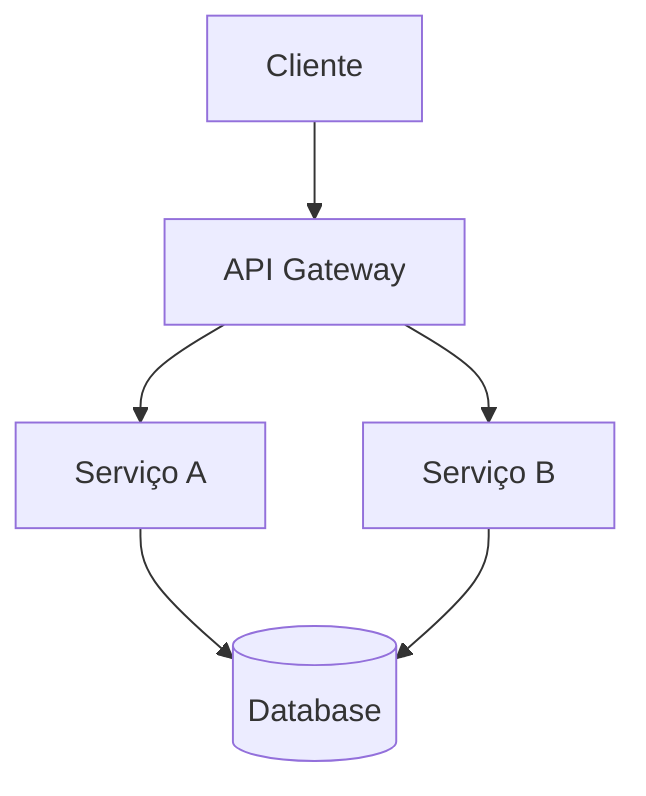
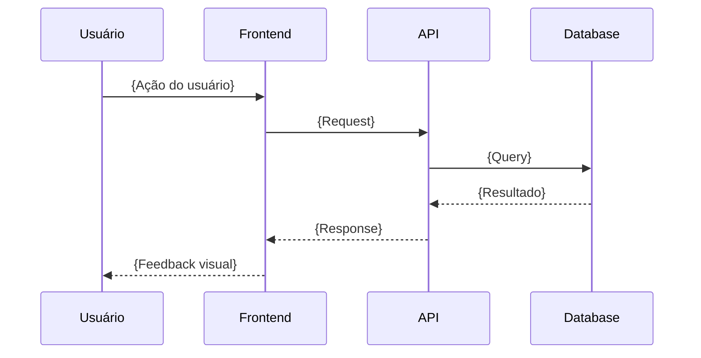
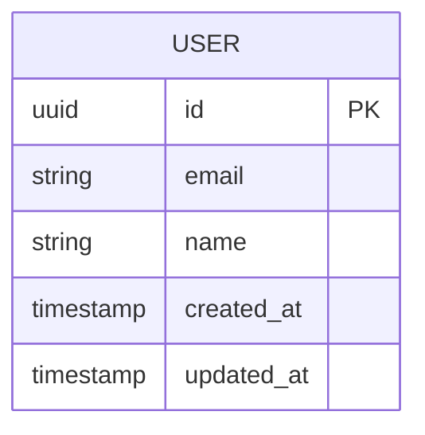

# SDD: {NOME_DO_PROJETO}

> **Autor:** {AUTOR} | **Data:** {DATA} | **Versão:** {VERSÃO} | **PRD:** [Link para PRD](./prd.md) | **Status:** Rascunho | Em Revisão | Aprovado

---

## 1. Contexto e Motivação

### 1.1 Problema Técnico

{Qual problema técnico este SDD resolve? Referencie seções específicas do PRD.}

### 1.2 Contexto

{Estado atual do sistema. Inclua: arquitetura existente (se houver), dívida técnica relevante, constraints de infraestrutura, orçamento, equipe e prazos.}

---

## 2. Objetivos e Não-Objetivos Técnicos

### ✅ Objetivos

- {O que este SDD cobre — decisões técnicas, componentes, integrações}
- {Objetivo técnico 2}
- {Objetivo técnico 3}

### ❌ Não-Objetivos

- {O que está fora de escopo técnico deliberadamente}
- {Não-objetivo técnico 2}
- {Não-objetivo técnico 3}

---

## 3. Design Proposto

### 3.1 Arquitetura de Alto Nível



> **Instrução para o agente:** Substitua o diagrama acima por uma representação fiel da arquitetura proposta. Use nós descritivos e inclua todos os componentes significativos (clientes, APIs, serviços, bancos de dados, filas, caches, serviços externos).

### 3.2 Componentes

| Componente | Responsabilidade | Tecnologia | Justificativa                    |
|------------|------------------|------------|----------------------------------|
| {Nome}     | {O que faz}      | {Tech}     | {Por que esta tech foi escolhida} |
| {Nome}     | {O que faz}      | {Tech}     | {Por que esta tech foi escolhida} |
| {Nome}     | {O que faz}      | {Tech}     | {Por que esta tech foi escolhida} |

### 3.3 Fluxo de Dados



> **Instrução para o agente:** Criar um sequenceDiagram para cada fluxo principal do sistema. Incluir participantes, chamadas síncronas e assíncronas, e tratamento de erro quando relevante.

### 3.4 Stack Tecnológica

| Camada    | Tecnologia | Versão | Justificativa                         |
|-----------|------------|--------|---------------------------------------|
| Frontend  | {Tech}     | {v}    | {Por que esta tecnologia foi escolhida} |
| Backend   | {Tech}     | {v}    | {Por que esta tecnologia foi escolhida} |
| Database  | {Tech}     | {v}    | {Por que esta tecnologia foi escolhida} |
| Cache     | {Tech}     | {v}    | {Por que esta tecnologia foi escolhida} |
| Infra     | {Tech}     | {v}    | {Por que esta tecnologia foi escolhida} |
| CI/CD     | {Tech}     | {v}    | {Por que esta tecnologia foi escolhida} |

---

## 4. APIs e Contratos

### 4.1 {Nome do Endpoint}

- **Método:** {GET/POST/PUT/PATCH/DELETE}
- **Path:** `/api/v1/{resource}`
- **Autenticação:** {Bearer Token / API Key / Nenhuma}
- **Request Headers:**

```
Authorization: Bearer {token}
Content-Type: application/json
```

- **Request Body:**

```json
{
  "campo": "tipo — descrição do campo"
}
```

- **Response (200 — Sucesso):**

```json
{
  "campo": "tipo — descrição do campo"
}
```

- **Erros:**

| Código | Descrição       | Quando ocorre                 |
|--------|-----------------|-------------------------------|
| 400    | Bad Request     | {Condição que causa o erro}   |
| 401    | Unauthorized    | {Condição que causa o erro}   |
| 403    | Forbidden       | {Condição que causa o erro}   |
| 404    | Not Found       | {Condição que causa o erro}   |
| 422    | Unprocessable   | {Condição que causa o erro}   |
| 429    | Rate Limited    | {Condição que causa o erro}   |
| 500    | Internal Error  | {Condição que causa o erro}   |

> **Instrução para o agente:** Repetir esta seção (4.1, 4.2, 4.3...) para cada endpoint da API. Incluir exemplos realistas nos payloads JSON.

---

## 5. Modelo de Dados

### 5.1 Diagrama ER



> **Instrução para o agente:** Expandir o diagrama ER para cobrir todas as entidades do sistema, com campos, tipos, chaves primárias (PK), chaves estrangeiras (FK) e relacionamentos.

### 5.2 Descrição das Entidades

#### {Nome da Entidade}

| Campo       | Tipo        | Constraints      | Descrição                          |
|-------------|-------------|------------------|------------------------------------|
| id          | UUID        | PK, NOT NULL     | {Identificador único}              |
| {campo}     | {tipo}      | {constraints}    | {Descrição do campo}               |
| created_at  | TIMESTAMP   | NOT NULL, DEFAULT| {Timestamp de criação}             |
| updated_at  | TIMESTAMP   | NOT NULL         | {Timestamp de última atualização}  |

### 5.3 Índices

| Tabela   | Colunas    | Tipo    | Justificativa                    |
|----------|------------|---------|----------------------------------|
| {Tabela} | {Colunas}  | {B-tree/Hash/GIN} | {Por que este índice é necessário} |

### 5.4 Estratégia de Migração

{Como migrar dados existentes, se aplicável. Incluir: ordem das migrações, estratégia de backfill, plano de rollback de migração.}

---

## 6. Segurança

### 6.1 Autenticação

{Método de autenticação: JWT, OAuth2, SAML, etc. Detalhes de implementação: fluxo de login, refresh tokens, expiração.}

### 6.2 Autorização

{Modelo de autorização: RBAC, ABAC, etc. Definição de roles e permissões.}

| Role      | Permissões                    | Escopo            |
|-----------|-------------------------------|-------------------|
| {Role}    | {Lista de permissões}         | {Onde se aplica}  |

### 6.3 Proteção de Dados

- **Dados em trânsito:** {TLS 1.3, certificate pinning}
- **Dados em repouso:** {AES-256, KMS}
- **PII handling:** {Quais dados são PII, como são tratados}
- **Retenção:** {Política de retenção de dados}

### 6.4 Vetores de Ataque Considerados

| Vetor                     | Mitigação                                  |
|---------------------------|--------------------------------------------|
| {SQL Injection}           | {Prepared statements, ORM}                |
| {XSS}                    | {CSP headers, sanitização de input}        |
| {CSRF}                   | {CSRF tokens, SameSite cookies}            |
| {Brute force}            | {Rate limiting, lockout, CAPTCHA}          |
| {Escalação de privilégio} | {Validação server-side, princípio do menor privilégio} |

---

## 7. Observabilidade

### 7.1 Logs

- **Formato:** {JSON estruturado}
- **Campos obrigatórios:** `timestamp`, `request_id`, `user_id`, `action`, `level`, `service`
- **Níveis:** DEBUG, INFO, WARN, ERROR, FATAL
- **Retenção:** {Política de retenção}
- **Destino:** {Serviço de log: CloudWatch, Datadog, ELK}

### 7.2 Métricas

| Métrica                  | Tipo      | Labels                | Alerta                          |
|--------------------------|-----------|-----------------------|---------------------------------|
| `http_requests_total`    | Counter   | method, path, status  | {Condição de alerta}            |
| `http_request_duration`  | Histogram | method, path          | {Condição de alerta}            |
| `db_connections_active`  | Gauge     | pool                  | {Condição de alerta}            |
| {Nome}                   | {Tipo}    | {Labels}              | {Condição de alerta}            |

### 7.3 Traces

- **Ferramenta:** {OpenTelemetry, Jaeger, etc.}
- **Propagação:** {W3C Trace Context}
- **Sampling:** {Taxa de amostragem: 100% em erros, 10% em sucesso}
- **Spans instrumentados:** {Lista de spans chave}

### 7.4 Alertas

| Alerta                          | Condição              | Severidade | Ação / Runbook         |
|---------------------------------|-----------------------|------------|------------------------|
| Alta taxa de erros 5xx          | >1% em 5 minutos     | P1         | {Link para runbook}    |
| Latência p99 degradada          | >X ms por 10 minutos  | P2         | {Link para runbook}    |
| Uso de CPU do banco de dados    | >80% por 5 minutos    | P2         | {Link para runbook}    |
| {Nome}                          | {Threshold}           | P1/P2/P3   | {Ação}                 |

---

## 8. Escalabilidade e Performance

### 8.1 SLOs

| Métrica          | Target       |
|------------------|--------------|
| Disponibilidade  | {99.9%}      |
| Latência p50     | {<100ms}     |
| Latência p99     | {<500ms}     |
| Throughput       | {X req/s}    |
| Error rate       | {<0.1%}      |

### 8.2 Estratégia de Escalabilidade

- **Horizontal:** {Auto-scaling de instâncias: min/max, métrica de trigger}
- **Vertical:** {Limits de recursos por instância}
- **Cache:** {Estratégia de caching: TTL, invalidação}
- **CDN:** {Quais assets são servidos via CDN}

### 8.3 Limites e Gargalos Conhecidos

| Gargalo                    | Limite Esperado       | Plano de Mitigação             |
|----------------------------|-----------------------|--------------------------------|
| {Descrição do gargalo}     | {Valor/Threshold}     | {Como resolver quando atingir} |

---

## 9. Trade-offs e Alternativas Consideradas

### Decisão 1: {Descrição da decisão}

| Opção              | Prós           | Contras          | Veredicto                 |
|---------------------|----------------|------------------|---------------------------|
| A: {Opção escolhida}| {Vantagens}   | {Desvantagens}   | ✅ Escolhida              |
| B: {Opção rejeitada}| {Vantagens}   | {Desvantagens}   | ❌ Rejeitada: {motivo}    |

> **Instrução para o agente:** Documentar todas as decisões técnicas significativas. Para cada decisão, listar pelo menos 2 alternativas com prós, contras e justificativa clara.

### Dívida Técnica Aceita

- {Item de dívida técnica aceito conscientemente}
  - **Justificativa:** {Por que foi aceito}
  - **Plano de resolução:** {Quando e como será resolvido}
  - **Risco se não resolver:** {Impacto de manter a dívida}

---

## 10. Plano de Rollout

### 10.1 Fases

| Fase         | Escopo          | Duração   | Critério de Avanço                     |
|--------------|-----------------|-----------|----------------------------------------|
| 1. Canary    | {1% tráfego}    | {1 dia}   | {Zero erros P1, métricas estáveis}     |
| 2. Gradual   | {10% → 50%}    | {3 dias}  | {Métricas estáveis, sem regressão}     |
| 3. GA        | {100%}          | {-}       | {Aprovação final do time}              |

### 10.2 Feature Flags

| Flag                    | Tipo      | Default | Descrição                       |
|-------------------------|-----------|---------|---------------------------------|
| `{feature_flag_name}`   | Boolean   | false   | {O que controla}                |

### 10.3 Rollback Plan

- **Trigger de rollback:** {Condições que ativam rollback automático}
- **Processo:** {Passos para reverter}
- **Tempo estimado:** {SLO de rollback}
- **Verificação pós-rollback:** {Como confirmar que o rollback foi bem sucedido}

---

## 11. Estratégia de Testes

| Tipo          | Escopo                | Ferramentas          | Cobertura Mínima         |
|---------------|----------------------|----------------------|--------------------------|
| Unitário      | Lógica de negócio    | {Jest/pytest/etc.}   | {80%}                    |
| Integração    | APIs e banco         | {Supertest/httpx}    | {Endpoints críticos}     |
| E2E           | Fluxos do usuário    | {Playwright/Cypress} | {Happy paths + críticos} |
| Performance   | Carga e stress       | {k6/Locust}          | {SLOs atingidos}         |
| Segurança     | OWASP Top 10         | {SAST/DAST tools}    | {Zero vulnerabilidades críticas} |

---

## Apêndice A: Seções para Sistemas com IA/LLM

> **Instrução para o agente:** Incluir este apêndice apenas quando o sistema envolver componentes de Inteligência Artificial, modelos de linguagem (LLM), RAG, ou decisões automatizadas baseadas em IA.

### A.1 Estratégia RAG

- **Fontes de dados:** {Lista de fontes de dados para retrieval}
- **Chunking:** {Estratégia de chunking: tamanho, overlap, método}
- **Vetorização:** {Modelo de embedding: nome, dimensões, provedor}
- **Retrieval:** {Algoritmo de busca: cosine similarity, hybrid search. Top-k padrão.}
- **Reranking:** {Modelo de reranking, se aplicável}

### A.2 Gestão de Prompts

- **Versionamento:** {Como prompts são versionados: Git, banco, config service}
- **Testes de regressão:** {Suite de testes com golden answers para cada prompt}
- **Templates:** {Como variáveis são injetadas nos prompts}
- **Guardrails:** {Limites de output, validação de formato, content filtering}

### A.3 Fallbacks

- {Comportamento quando LLM falha (timeout, erro de API, rate limit)}
- {Degradação graciosa: regras determinísticas, cache de respostas anteriores}
- {Modelo de fallback: modelo menor/mais barato como backup}

### A.4 Custo Projetado

| Cenário | Requests/dia | Tokens/request (avg) | Custo/request | Custo/mês |
|---------|-------------|---------------------|---------------|-----------|
| Baixo   | {X}         | {Y}                 | {$Z}          | {$W}      |
| Médio   | {X}         | {Y}                 | {$Z}          | {$W}      |
| Alto    | {X}         | {Y}                 | {$Z}          | {$W}      |

### A.5 Logging de IA

- **Inputs registrados:** {Quais inputs do usuário são logados}
- **Outputs registrados:** {Quais respostas do modelo são logadas}
- **Metadados:** {Versão do prompt, modelo usado, tokens, latência}
- **Política de retenção:** {Por quanto tempo logs de IA são mantidos}
- **Auditoria:** {Quem tem acesso, como é auditado}
- **PII em logs:** {Estratégia de redação de dados sensíveis}

### A.6 Avaliação de Saídas

- **Rubrica:** {Critérios de qualidade: precisão, relevância, completude, tom}
- **Golden answers:** {Dataset de referência com entradas e saídas esperadas}
- **Métricas quantitativas:** {Acurácia, recall, F1, BLEU, ROUGE — conforme aplicável}
- **Avaliação humana:** {Cadência de revisão humana, critérios}
