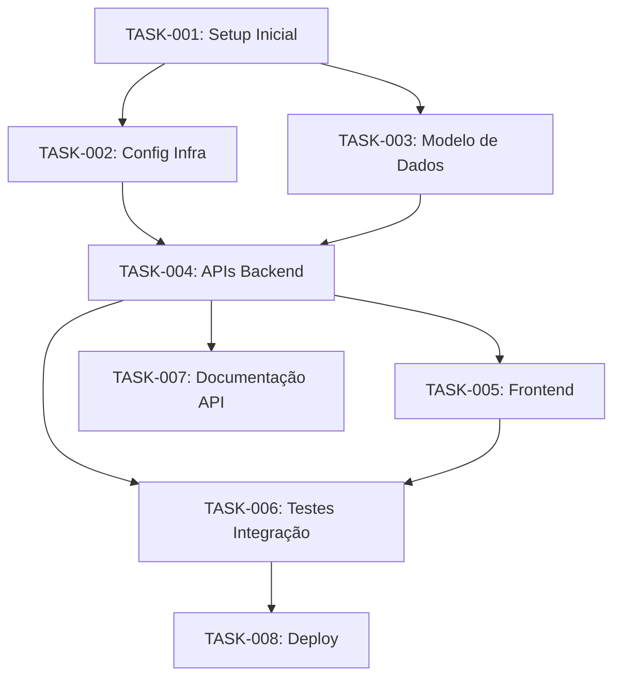

# Tasks: {NOME_DO_PROJETO}

> **Gerado a partir do SDD:** [Link](./sdd.md) | **Data:** {DATA} | **Total de Tasks:** {N}

---

## Resumo

| Tipo        | Quantidade | Estimativa Total |
|-------------|-----------|------------------|
| Setup       | {N}       | {Xh}             |
| Feature     | {N}       | {Xh}             |
| Teste       | {N}       | {Xh}             |
| Docs        | {N}       | {Xh}             |
| **Total**   | **{N}**   | **{Xh}**         |

### Legenda de Estimativas

| Tamanho | Sigla | Horas Estimadas |
|---------|-------|-----------------|
| Pequena | P     | 1-2h            |
| Média   | M     | 3-5h            |
| Grande  | G     | 6-10h           |
| Extra   | XG    | 11-20h          |

### Legenda de Status

| Ícone | Significado  |
|-------|-------------|
| ⬜    | Pendente     |
| 🔄    | Em Progresso |
| ✅    | Concluída    |
| ⛔    | Bloqueada    |
| 🚫    | Cancelada    |

---

## Fase 1: Setup e Infraestrutura

### TASK-001: {Título da Task}

- **Tipo:** setup
- **Descrição:** {2-4 frases descrevendo o que precisa ser feito, por que, e qual resultado esperado}
- **Componente SDD:** {Referência à seção do SDD: ex: "3.4 Stack Tecnológica"}
- **Dependências:** Nenhuma
- **Critério de Conclusão:**
  - [ ] {Condição verificável 1}
  - [ ] {Condição verificável 2}
- **Estimativa:** P (pequena)
- **Status:** ⬜ Pendente

### TASK-002: {Título da Task}

- **Tipo:** setup
- **Descrição:** {2-4 frases}
- **Componente SDD:** {Seção do SDD}
- **Dependências:** TASK-001
- **Critério de Conclusão:**
  - [ ] {Condição verificável 1}
  - [ ] {Condição verificável 2}
- **Estimativa:** M (média)
- **Status:** ⬜ Pendente

---

## Fase 2: Modelo de Dados

### TASK-003: {Título da Task}

- **Tipo:** feature
- **Descrição:** {2-4 frases}
- **Componente SDD:** {Seção 5 — Modelo de Dados}
- **Dependências:** TASK-001
- **Critério de Conclusão:**
  - [ ] {Condição verificável 1}
  - [ ] {Condição verificável 2}
- **Estimativa:** M (média)
- **Status:** ⬜ Pendente

> **Instrução para o agente:** Adicionar tasks para cada entidade do modelo de dados, migrações e seeds.

---

## Fase 3: APIs e Backend

### TASK-004: {Título da Task}

- **Tipo:** feature
- **Descrição:** {2-4 frases}
- **Componente SDD:** {Seção 4 — APIs e Contratos}
- **Dependências:** TASK-003
- **Critério de Conclusão:**
  - [ ] {Condição verificável 1}
  - [ ] {Condição verificável 2}
- **Estimativa:** G (grande)
- **Status:** ⬜ Pendente

> **Instrução para o agente:** Criar uma task para cada endpoint ou grupo de endpoints relacionados. Incluir validação, tratamento de erros e testes unitários na mesma task ou em tasks separadas conforme complexidade.

---

## Fase 4: Frontend

### TASK-005: {Título da Task}

- **Tipo:** feature
- **Descrição:** {2-4 frases}
- **Componente SDD:** {Seção do SDD correspondente}
- **Dependências:** TASK-004
- **Critério de Conclusão:**
  - [ ] {Condição verificável 1}
  - [ ] {Condição verificável 2}
- **Estimativa:** G (grande)
- **Status:** ⬜ Pendente

> **Instrução para o agente:** Criar tasks para cada componente de UI significativo: layout, páginas, formulários, componentes reutilizáveis, integração com API.

---

## Fase 5: Integração e Testes

### TASK-006: {Título da Task}

- **Tipo:** teste
- **Descrição:** {2-4 frases}
- **Componente SDD:** {Seção 11 — Estratégia de Testes}
- **Dependências:** TASK-004, TASK-005
- **Critério de Conclusão:**
  - [ ] {Condição verificável 1}
  - [ ] {Condição verificável 2}
- **Estimativa:** M (média)
- **Status:** ⬜ Pendente

> **Instrução para o agente:** Incluir tasks para testes de integração, testes E2E, testes de performance e testes de segurança conforme definido no SDD.

---

## Fase 6: Documentação e Deploy

### TASK-007: {Título da Task}

- **Tipo:** docs
- **Descrição:** {2-4 frases}
- **Componente SDD:** {Seção relevante}
- **Dependências:** TASK-004
- **Critério de Conclusão:**
  - [ ] {Condição verificável 1}
  - [ ] {Condição verificável 2}
- **Estimativa:** P (pequena)
- **Status:** ⬜ Pendente

### TASK-008: {Título da Task}

- **Tipo:** setup
- **Descrição:** {2-4 frases sobre configuração de deploy}
- **Componente SDD:** {Seção 10 — Plano de Rollout}
- **Dependências:** TASK-006
- **Critério de Conclusão:**
  - [ ] {Condição verificável 1}
  - [ ] {Condição verificável 2}
- **Estimativa:** M (média)
- **Status:** ⬜ Pendente

---

## Grafo de Dependências

> **Instrução para o agente:** Atualizar o grafo de dependências para refletir todas as tasks criadas. Usar cores ou estilos para indicar o caminho crítico quando possível.

---

## Notas de Execução

> **Instrução para o agente ao gerar este documento:**
>
> 1. Cada task deve ser atômica — executável em uma única sessão de trabalho focado.
> 2. Tasks grandes (XG) devem ser quebradas em subtasks.
> 3. O critério de conclusão deve ser verificável programaticamente sempre que possível (ex: "testes passam", "endpoint retorna 200", "migração roda sem erro").
> 4. Manter consistência de IDs: TASK-NNN, numeração sequencial sem lacunas.
> 5. Dependências devem formar um DAG (grafo acíclico dirigido) — verificar que não há ciclos.
> 6. Estimar com base na complexidade real, não no esforço ideal. Incluir tempo de testes e revisão.
