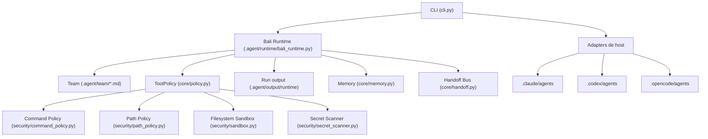

# Guia de Arquitetura do Bali-Agent

O **Bali-Agent** foi projetado como um orquestrador de subagentes com CLI, runtime e adapters. Ele universaliza o contrato de time, handoff, memoria, gates e auditoria; a execucao real acontece quando o Bali Runtime esta configurado ou quando o host nativo oferece mecanismo compativel de subagente.

Quando o Bali Runtime e o caminho de execucao, controles programaticos em Python aplicam limites de comando, path, ferramentas, artefatos e revisao. Em hosts nativos, Bali materializa contratos e instrucoes; isolamento e permissao final dependem das capacidades do host.

## Diagrama da Arquitetura

## Componentes Principais

### 1. Camada CLI e Entry Point (`bali_agent/cli.py`)

- Unifica a interacao humana com o framework.
- Fornece comandos como `init`, `verify`, `run`, `list-agents`, `create-agent`, `remember`, `inspect-runs`, `capability-report`, `audit-readme` e `verify-adapter`.
- Delega `run` para `.agent/runtime/bali_runtime.py` quando o runtime esta instalado no projeto alvo.

### 2. Loop de Orquestracao e Execucao

- O Runtime controla o ciclo de vida das etapas de subagente quando ele e o executor configurado.
- Fora do Runtime, Bali materializa contratos/adapters e a execucao fica a cargo do host nativo.
- O fluxo estruturado carrega o manifesto, cria prompts isolados, chama o runner configurado, persiste artefatos e exige Reviewer estruturado.

### 3. Policy Engine (`bali_agent/core/policy.py`)

- A camada de seguranca usada pelas tools do Bali-Agent.
- Quando o fluxo passa pelo Runtime/tools locais, chamadas de leitura, escrita e shell sao avaliadas por politica.
- Em hosts nativos, a aplicacao final das permissoes depende do adapter e dos controles do proprio host.

### 4. Gestao de Contexto e Tokens (`bali_agent/core/context.py`)

- `ContextPacker` calcula o consumo estimado de tokens das mensagens.
- Aplica uma janela deslizante para truncar saidas longas antigas.
- Registra inclusoes de arquivo em manifests de contexto quando esse caminho de runner/tooling e usado.

### 5. Memoria e Handoff (`bali_agent/core/memory.py`, `bali_agent/core/handoff.py`)

- A memoria operacional armazena fatos indexados localmente via SQLite FTS5.
- O Handoff Bus prove uma fila serializada para troca de controle atomica entre subagentes.
- No Bali Runtime, o `memory-curator` pode registrar aprendizado no fim de runs aprovados.
