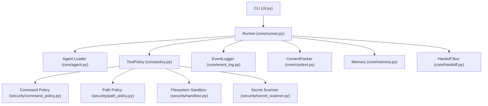

# Guia de Arquitetura do Bali-Agent

O **Bali-Agent** foi projetado como um runtime agêntico modular, seguro por design e LLM-agnóstico. Em vez de relying on text prompts para isolamento e permissões, o Bali-Agent implementa controle programático estrito em Python.

## Diagrama da Arquitetura

## Componentes Principais

### 1. Camada CLI e Entry Point (`bali_agent/cli.py`)
- Unifica a interação humana com o framework.
- Fornece comandos como `init`, `verify`, `run`, `list-agents`, `create-agent`, `remember`, `inspect-runs` e `verify-adapter`.

### 2. Loop de Execução e Orquestração (`bali_agent/core/runner.py`)
- Controla o ciclo de vida do agente e subagentes.
- Garante o fluxo estruturado:
  1. Carrega a configuração do subagente do manifesto.
  2. Inicializa checkpoints de estado e histórico de mensagens.
  3. Aciona o loop de prompt/tool call.
  4. Executa a decisão final via Reviewer estruturado.

### 3. Policy Engine (`bali_agent/core/policy.py`)
- O cérebro de segurança do Bali-Agent. Toda chamada de ferramenta (leitura de arquivo, escrita de arquivo, execução de shell) passa obrigatoriamente por essa classe.
- Controla as classes de risco de comandos (R0 a R4) e as permissões de leitura/escrita de caminhos.

### 4. Gestão de Contexto e Tokens (`bali_agent/core/context.py`)
- `ContextPacker` calcula o consumo estimado de tokens das mensagens.
- Aplica um algoritmo de **Sliding Window** truncando saídas longas antigas.
- Registra cada inclusão de arquivo no arquivo `context_manifest.json` gerado a cada execução.

### 5. Memória e Handoff (`bali_agent/core/memory.py`, `bali_agent/core/handoff.py`)
- A memória operacional armazena fatos indexados localmente via SQLite FTS5 (com busca por relevância textual).
- O Handoff Bus provê uma fila serializada para troca de controle atômica entre subagentes (`from_agent` -> `to_agent` com mensagem associada).
