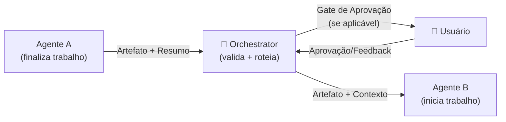
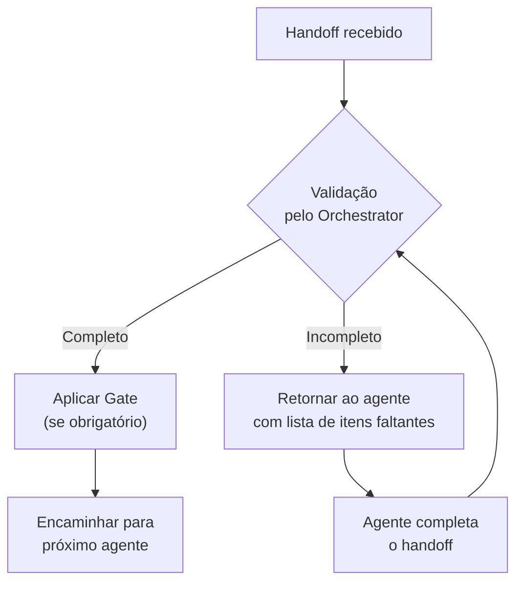

# Protocolo de Handoff entre Agentes

> **Propósito**: Garantir que a transição entre agentes preserve 100% do contexto, decisões e artefatos, eliminando perda de informação entre fases.

---

## 1. Visão Geral

O handoff é o momento mais crítico do fluxo. Quando um agente finaliza seu trabalho, ele **DEVE** produzir dois elementos antes de transferir o controle:

1. **Artefato**: O documento principal produzido pela fase (Discovery Doc, PRD, SDD, Tasks, Código, Review)
2. **Resumo de Handoff**: Um bloco estruturado que contextualiza o artefato para o próximo agente

O **Orchestrator** é o intermediário de todo handoff. Nenhum agente se comunica diretamente com outro — tudo passa pelo Orchestrator.



---

## 2. Formato do Resumo de Handoff

Todo resumo de handoff **DEVE** seguir este formato padronizado:

```yaml
# === HANDOFF ===
handoff:
  de: "[nome-do-agente-atual]"
  para: "[nome-do-proximo-agente]"
  fase_concluida: "[nome-da-fase]"
  timestamp: "[data-hora ISO 8601]"

  resumo_executivo: |
    [2-3 frases descrevendo o que foi realizado nesta fase]

  artefato:
    tipo: "[discovery-doc | prd | sdd | tasks | codigo | review]"
    caminho: "[caminho/para/o/artefato.md]"
    versao: "[v1.0 | v1.1 | etc]"

  decisoes_tomadas:
    - decisao: "[descrição da decisão]"
      justificativa: "[por que esta decisão foi tomada]"
    - decisao: "[outra decisão]"
      justificativa: "[justificativa]"

  pendencias:
    - "[item pendente que o próximo agente precisa resolver]"
    - "[outro item, se houver]"

  contexto_critico:
    - "[informação que o próximo agente PRECISA saber]"
    - "[restrição ou requisito importante]"

  feedback_usuario: |
    [Se houve feedback no gate de aprovação, incluir aqui na íntegra.
     Se não houve gate, indicar "N/A - sem gate nesta transição"]

  status: "[completo | completo-com-ressalvas | parcial]"
# === FIM HANDOFF ===
```

---

## 3. Regras do Handoff

### 3.1 Regras para o Agente que ENVIA

| # | Regra | Motivo |
|---|-------|--------|
| 1 | **DEVE** produzir o artefato completo antes do resumo | O resumo referencia o artefato — sem artefato, sem handoff |
| 2 | **DEVE** listar TODAS as decisões tomadas | O próximo agente precisa saber o que já foi decidido para não contradizer |
| 3 | **DEVE** listar pendências identificadas | Pendências não resolvidas devem ser explicitamente transferidas |
| 4 | **DEVE** incluir contexto crítico | Informações que o próximo agente precisa mas que podem não ser óbvias no artefato |
| 5 | **DEVE** incluir feedback do usuário (se houve gate) | Feedback pode conter ajustes que afetam o trabalho do próximo agente |
| 6 | **NÃO DEVE** assumir que o próximo agente tem contexto prévio | O handoff deve ser auto-suficiente |

### 3.2 Regras para o Agente que RECEBE

| # | Regra | Motivo |
|---|-------|--------|
| 1 | **DEVE** ler o artefato completo antes de iniciar qualquer trabalho | O resumo é um atalho, mas o artefato é a fonte da verdade |
| 2 | **DEVE** verificar se há pendências para resolver | Pendências do agente anterior podem se tornar bloqueadores |
| 3 | **DEVE** respeitar decisões já tomadas | Não reverter decisões sem justificativa explícita e aprovação |
| 4 | **DEVE** referenciar o artefato anterior em seu próprio artefato | Rastreabilidade — cada artefato aponta para sua origem |
| 5 | **PODE** solicitar esclarecimento via Orchestrator | Se o handoff for insuficiente, o agente pode pedir mais contexto |

### 3.3 Regras para o Orchestrator

| # | Regra | Motivo |
|---|-------|--------|
| 1 | **DEVE** validar que o handoff está completo antes de rotear | Handoffs incompletos geram retrabalho |
| 2 | **DEVE** aplicar o gate de aprovação (se a fase exigir) antes de encaminhar | O humano deve aprovar antes do próximo agente iniciar |
| 3 | **DEVE** incluir o feedback do usuário no handoff (se houver) | O próximo agente precisa do feedback para ajustar seu trabalho |
| 4 | **DEVE** manter registro de todos os handoffs | Auditoria e rastreabilidade do fluxo |

---

## 4. Checklist de Validação do Handoff

O Orchestrator usa este checklist para validar cada handoff antes de rotear:

```markdown
## Checklist de Handoff — [Fase] → [Próxima Fase]

- [ ] Artefato principal está completo e salvo no caminho correto
- [ ] Resumo de handoff segue o formato YAML padronizado
- [ ] Todos os campos obrigatórios estão preenchidos
- [ ] Decisões tomadas estão listadas com justificativas
- [ ] Pendências estão explicitamente documentadas
- [ ] Contexto crítico para o próximo agente está incluído
- [ ] Feedback do usuário (se aplicável) está incluído na íntegra
- [ ] Status está marcado corretamente (completo / completo-com-ressalvas / parcial)
- [ ] Gate de aprovação foi executado (se obrigatório para esta fase)
```

---

## 5. Exemplo de Handoff Real

### Cenário: Discovery → PRD Writer

Após entrevistar o usuário sobre um sistema de gestão de inventário para uma loja de roupas:

```yaml
# === HANDOFF ===
handoff:
  de: "discovery"
  para: "prd-writer"
  fase_concluida: "discovery"
  timestamp: "2025-01-15T14:30:00-03:00"

  resumo_executivo: |
    Entrevista concluída com 12 perguntas. O usuário precisa de um sistema web 
    de gestão de inventário para uma loja de roupas com 1 funcionário. Foco 
    principal é controle de estoque e registro de vendas. Prazo desejado: 3 meses.

  artefato:
    tipo: "discovery-doc"
    caminho: "output/inventario-loja/discovery.md"
    versao: "v1.0"

  decisoes_tomadas:
    - decisao: "Sistema será web (não mobile nativo)"
      justificativa: "Usuário opera primariamente de um computador na loja"
    - decisao: "Primeira versão sem integração com e-commerce"
      justificativa: "Usuário não vende online atualmente, pode adicionar depois"
    - decisao: "Relatórios mensais são prioridade sobre dashboards em tempo real"
      justificativa: "Usuário precisa de dados para decisões mensais de compra"

  pendencias:
    - "Definir se haverá suporte a múltiplas lojas no futuro (usuário mencionou possibilidade)"
    - "Esclarecer formato exato dos relatórios desejados (CSV? PDF? Dashboard?)"

  contexto_critico:
    - "Usuário tem pouca experiência técnica — interface deve ser extremamente simples"
    - "Loja tem ~500 SKUs atualmente"
    - "Orçamento limitado — preferência por soluções com free tier"
    - "Usuário mencionou frustração com planilhas Excel — qualquer solução já será melhor"

  feedback_usuario: |
    Usuário confirmou que o entendimento está correto. 
    Pediu para enfatizar a simplicidade da interface: 
    "Não quero nada complicado, quero abrir e já saber o que fazer."

  status: "completo"
# === FIM HANDOFF ===
```

---

## 6. Handoffs por Transição

### Referência rápida de cada transição do fluxo:

| De → Para | Artefato Transferido | Gate Obrigatório? | Contexto Crítico Típico |
|-----------|---------------------|-------------------|------------------------|
| Discovery → PRD Writer | Documento de Discovery | Sim (Gate 1) | Prioridades do usuário, restrições técnicas, público-alvo |
| PRD Writer → SDD Architect | PRD completo | Sim (Gate 2) | Requisitos não-funcionais, escopo vs fora-de-escopo, métricas |
| SDD Architect → Task Decomposer | SDD completo | Sim (Gate 3) | Stack escolhida, dependências entre componentes, riscos técnicos |
| Task Decomposer → Implementer | Lista de tasks priorizadas | Opcional (Gate 4) | Ordem de implementação, tasks paralelizáveis, critérios de conclusão |
| Implementer → Reviewer | PR com código + testes | Não (direto) | Decisões de implementação, desvios do SDD (se houver), débitos técnicos |
| Reviewer → Implementer (se rejeitado) | Review com feedback | Não (direto) | Issues encontrados, sugestões de melhoria, items bloqueadores |
| Reviewer → Orchestrator (se aprovado) | Aprovação do PR | Sim (Gate 5) | Confirmação de qualidade, observações para próximas tasks |

---

## 7. Tratamento de Falhas

### E se o handoff estiver incompleto?



### E se o agente receptor não entender o handoff?

1. O agente receptor solicita esclarecimento via Orchestrator
2. O Orchestrator pode re-consultar o agente anterior ou pedir ao usuário
3. O handoff é complementado antes de prosseguir

### E se houver conflito entre artefato e resumo?

- O **artefato** é a fonte da verdade
- O resumo é um atalho para orientação — se houver conflito, o artefato prevalece

---

## 8. Boas Práticas

1. **Seja explícito, não implícito** — Se uma decisão foi tomada, documente-a mesmo que pareça óbvia
2. **Prefira redundância a omissão** — É melhor o próximo agente ler algo que já sabe do que perder algo que precisava
3. **Inclua o "porquê"** — Decisões sem justificativa forçam o próximo agente a adivinhar
4. **Sinalize riscos** — Se você identificou um risco, coloque em `contexto_critico` mesmo que não seja sua responsabilidade resolver
5. **Use o feedback na íntegra** — Não resuma o feedback do usuário, inclua as palavras exatas quando possível

---

<p align="center">
  <em>Um handoff bem feito é a diferença entre um projeto fluido e um projeto caótico.</em>
</p>
